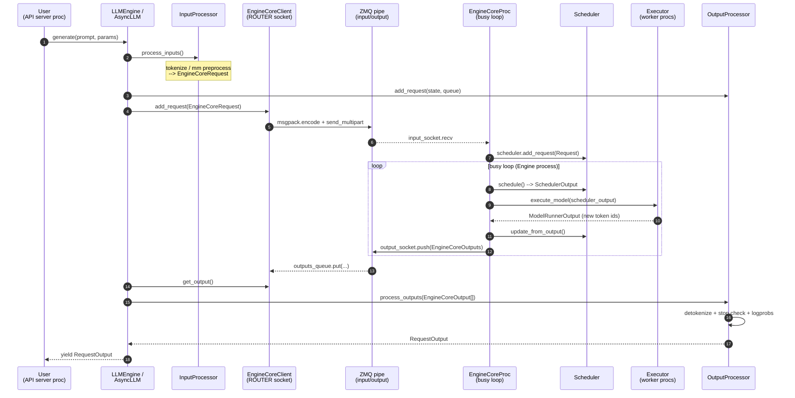

# 第 3 章 入口层与引擎层（Layer 1 - Layer 2）

本章对应整体架构图中最上面的两层：

- **Layer 1 Entrypoint**：用户面对的 API。离线为 `LLM` 类，在线为 FastAPI/OpenAI 兼容 server。
- **Layer 2 Engine**：把 Entrypoint 的请求翻译成可被 Scheduler/Worker 处理的 `EngineCoreRequest`，并把 `EngineCoreOutput` 还原成 `RequestOutput`。

V1 把这两层进一步切分成了 4 个跨进程角色，它们之间用 ZMQ 通信（DEALER/ROUTER + PUSH/PULL）：

<svg viewBox="0 0 760 320" xmlns="http://www.w3.org/2000/svg" class="figure-svg" role="img" aria-label="V1 跨进程三角色：User Code、API Server、EngineCore">
  <defs>
    <marker id="ch3ar" viewBox="0 0 10 10" refX="9" refY="5" markerWidth="7" markerHeight="7" orient="auto">
      <path d="M0,0 L10,5 L0,10 z" fill="#94a3b8"/>
    </marker>
  </defs>
  <text x="380" y="22" text-anchor="middle" font-size="13" font-weight="600" fill="currentColor">V1 的入口/引擎层被切成三个进程：通过 ZMQ 串起来</text>
  <g transform="translate(20, 60)">
    <rect x="0" y="0" width="200" height="150" fill="#fed7aa" stroke="#ea580c" stroke-width="1.5" rx="6"/>
    <text x="100" y="22" text-anchor="middle" font-size="13" font-weight="700" fill="#9a3412">User Code</text>
    <text x="100" y="40" text-anchor="middle" font-size="11" fill="#9a3412">（LLM / curl）</text>
    <line x1="20" y1="56" x2="180" y2="56" stroke="#fdba74"/>
    <text x="100" y="80" text-anchor="middle" font-size="11" fill="#7c2d12">用户代码进程</text>
    <text x="100" y="110" text-anchor="middle" font-size="11" font-weight="600" fill="#7c2d12">输入: prompt</text>
    <text x="100" y="130" text-anchor="middle" font-size="11" font-weight="600" fill="#7c2d12">输出: RequestOutput</text>
  </g>
  <g transform="translate(280, 60)">
    <rect x="0" y="0" width="200" height="150" fill="#99f6e4" stroke="#0d9488" stroke-width="1.5" rx="6"/>
    <text x="100" y="22" text-anchor="middle" font-size="13" font-weight="700" fill="#115e59">API Server Process</text>
    <text x="100" y="40" text-anchor="middle" font-size="11" fill="#115e59">LLMEngine / AsyncLLM</text>
    <line x1="20" y1="56" x2="180" y2="56" stroke="#5eead4"/>
    <text x="100" y="74" text-anchor="middle" font-size="11" fill="#134e4a">- InputProcessor</text>
    <text x="100" y="92" text-anchor="middle" font-size="11" fill="#134e4a">- OutputProcessor</text>
    <text x="100" y="110" text-anchor="middle" font-size="11" fill="#134e4a">- EngineCoreClient</text>
    <text x="100" y="138" text-anchor="middle" font-size="10" font-style="italic" fill="#0f766e">不持有 GPU</text>
  </g>
  <g transform="translate(540, 60)">
    <rect x="0" y="0" width="200" height="150" fill="#ddd6fe" stroke="#7c3aed" stroke-width="1.5" rx="6"/>
    <text x="100" y="22" text-anchor="middle" font-size="13" font-weight="700" fill="#5b21b6">EngineCore Process</text>
    <text x="100" y="40" text-anchor="middle" font-size="11" fill="#5b21b6">EngineCoreProc</text>
    <line x1="20" y1="56" x2="180" y2="56" stroke="#c4b5fd"/>
    <text x="100" y="74" text-anchor="middle" font-size="11" fill="#4c1d95">- Scheduler</text>
    <text x="100" y="92" text-anchor="middle" font-size="11" fill="#4c1d95">- Executor</text>
    <text x="100" y="110" text-anchor="middle" font-size="11" fill="#4c1d95">- busy loop</text>
    <text x="100" y="138" text-anchor="middle" font-size="10" font-style="italic" fill="#6d28d9">GPU 在这里</text>
  </g>
  <path d="M 222 110 L 277 110" fill="none" stroke="#94a3b8" stroke-width="1.4" marker-end="url(#ch3ar)"/>
  <path d="M 277 145 L 222 145" fill="none" stroke="#94a3b8" stroke-width="1.4" marker-end="url(#ch3ar)"/>
  <text x="250" y="105" text-anchor="middle" font-size="9" fill="#64748b">async/HTTP</text>
  <path d="M 482 110 L 537 110" fill="none" stroke="#ea580c" stroke-width="1.4" marker-end="url(#ch3ar)"/>
  <path d="M 537 145 L 482 145" fill="none" stroke="#0d9488" stroke-width="1.4" marker-end="url(#ch3ar)"/>
  <text x="510" y="105" text-anchor="middle" font-size="10" font-weight="600" fill="#475569">ZMQ</text>
  <text x="510" y="160" text-anchor="middle" font-size="9" fill="#64748b">DEALER/ROUTER + PUSH/PULL</text>
  <g transform="translate(40, 240)">
    <text x="0" y="0" font-size="11" fill="currentColor"><tspan font-weight="700" fill="#475569">读这张图：</tspan>左→中：用户的 prompt 在 API server 里被 tokenize 成 <tspan font-family="monospace" font-size="10">EngineCoreRequest</tspan>；中→右：经 ZMQ 推给 EngineCore，由其</text>
    <text x="0" y="18" font-size="11" fill="currentColor">scheduler 安排 step、executor 跑 forward。右→中：算好的 token 通过 PUSH/PULL 推回 API server，被 detokenize 成 <tspan font-family="monospace" font-size="10">RequestOutput</tspan>。</text>
    <text x="0" y="36" font-size="11" fill="currentColor">中→左：异步生成器/HTTP 流式返回用户。<tspan font-style="italic" fill="#94a3b8">API server 进程不持有 GPU——这是 V1 让 server 可独立扩展和重启的关键。</tspan></text>
  </g>
</svg>
<span class="figure-caption">图 R3.1 ｜ V1 把入口/引擎切成三个进程：User Code、API Server（仅 CPU，跑 HTTP + I/O）、EngineCore（拥有 GPU + Scheduler）。两边的 ZMQ 通道让 API server 可独立重启/扩容</span>

<details>
<summary>ASCII 原版</summary>

```
+-------------------+        +---------------------+        +---------------------+
| User Code         |        | API Server Process  |        | EngineCore Process  |
| (LLM / curl)      |  --->  | (LLMEngine /        |  --->  | (EngineCoreProc)    |
|                   |        |  AsyncLLM)          |  ZMQ   |  - Scheduler        |
|                   |        |  - InputProcessor   |  <---  |  - Executor         |
|                   |  <---  |  - OutputProcessor  |        |  - busy loop        |
+-------------------+        +---------------------+        +---------------------+
        prompt                request_id, queue                   token_ids
       RequestOutput          RequestOutput                  EngineCoreOutput
```

</details>

阅读完本章你应该能回答：

1. `LLM.generate(...)` 调用栈一直到 GPU 上 forward 经过了哪些进程？
2. 为什么 `EngineCore` 要单独跑在一个进程里？
3. `EngineCoreClient` 的三种实现各自适配什么场景？
4. AsyncLLM 的 `output_handler` 协程在做什么？
5. 一个 `prompt: str` 如何变成 `EngineCoreRequest`？

> 本章只覆盖 V1（`vllm/v1/*`）。legacy 的 `vllm/engine/*` 已经在被移除中，不要参考。

---

## 3.1 全景：请求生命周期一图流



下表给出图中各步骤所在的物理进程：

| 步骤 | 所在进程 | 关键代码 |
| ---- | -------- | -------- |
| 1-4  | API server 进程（=用户进程，离线情况下） | `vllm/v1/engine/llm_engine.py:209` `add_request` |
| 5    | Engine 输入 IO 线程 | `vllm/v1/engine/core.py:1395` `process_input_sockets` |
| 6    | Engine 主线程 busy loop | `vllm/v1/engine/core.py:1187` `run_busy_loop` |
| 7-8  | Engine 主线程 + Executor 子进程 | `vllm/v1/engine/core.py:425` `step` |
| 9    | Engine 主线程 | `vllm/v1/engine/core.py:425` `step` |
| 10   | Engine 输出 IO 线程 | `vllm/v1/engine/core.py:1489` `process_output_sockets` |
| 11-13 | API server 进程的 output handler | `vllm/v1/engine/async_llm.py:656` 或 `llm_engine.py:287` `step` |

下面分层详细讲。

---

## 3.2 离线入口：`LLM` 类

### 3.2.1 定位与设计动机

`vllm/entrypoints/llm.py:92` 的 `LLM` 是 vLLM 最常被引用的对象，它的语义是：**一次性把全部 prompt 提交给同步引擎，再阻塞等到全部完成**。它不暴露异步接口，是因为离线批量场景下：

- 用户已经准备好整批数据，不需要 streaming；
- 不需要并发新请求；
- 进度条 (`tqdm`) 在阻塞模式下比异步模式下好做。

`LLM` **不包含**模型权重或 KV cache，它只持有一个 `LLMEngine`，把所有重活委托出去。

### 3.2.2 构造

```python
# vllm/entrypoints/llm.py:198
class LLM(PoolingOfflineMixin):
    def __init__(self, model: str, *, ..., **kwargs):
        ...
        engine_args = EngineArgs(model=model, ..., **kwargs)
        self.llm_engine = LLMEngine.from_engine_args(
            engine_args=engine_args,
            usage_context=UsageContext.LLM_CLASS,
        )
        self.model_config = self.llm_engine.model_config
        self.request_counter = Counter()
```

要点：

1. `kwargs` 是兜底口子，把所有非显式参数透传给 `EngineArgs`——这就是为何用户能在 `LLM()` 里写 `enable_prefix_caching=True` 等 engine-level 参数。
2. `LLM` 强制 `disable_log_stats=True`（`llm.py:254`），因为离线场景不希望每个 step 都打日志。
3. 多进程 DP 在 `LLM` 中是被禁止的（`llm.py:312-322`），因为单进程同步 API 无法驱动多个 DP worker。

### 3.2.3 `generate()` 同步等待

```python
# vllm/entrypoints/llm.py:423
def generate(self, prompts, sampling_params=None, ...):
    if sampling_params is None:
        sampling_params = self.get_default_sampling_params()
    return self._run_completion(
        prompts=prompts, params=sampling_params,
        output_type=RequestOutput, ...
    )
```

`_run_completion`（`llm.py:1208`）的两步：

1. `_add_completion_requests(...)`：渲染并加入所有 prompt；
2. `_run_engine(...)`：阻塞循环 step 直到全部完成。

阻塞循环的核心就是这段：

```python
# vllm/entrypoints/llm.py:1440
while self.llm_engine.has_unfinished_requests():
    step_outputs = self.llm_engine.step()
    for output in step_outputs:
        if output.finished:
            outputs.append(output)
            if use_tqdm:
                ...  # update progress bar
```

注意 `output_kind` 在 `_add_request` 中被强制改写：

```python
# vllm/entrypoints/llm.py:1405
if isinstance(params, SamplingParams):
    params.output_kind = RequestOutputKind.FINAL_ONLY
```

**为什么？** 同步 API 用户拿到的是 `RequestOutput` 列表，没有 stream consumer；只在 `output.finished == True` 时返回一次最终结果即可，省掉每一步序列化中间结果的开销。

### 3.2.4 `chat()`

`chat()`（`llm.py:958`）只是套了一层 chat template 渲染：把 `messages` 用 tokenizer 的 chat template 转成纯文本（或 token id），然后走和 `generate` 同样的通路。具体在 `_run_chat`（`llm.py:1233`）里调用 `_preprocess_chat_one` 再 `_render_and_run_requests`。

### 3.2.5 `encode()` / pooling

`encode()` 由 `PoolingOfflineMixin` 提供，对应 embedding/classify/score 等 pooling 任务。它和 `generate` 共用同一个 `LLMEngine`，只是传入 `PoolingParams` 而非 `SamplingParams`。区分点在 `vllm/v1/engine/output_processor.py:222`：

```python
if sampling_params := request.sampling_params:
    ...
    detokenizer = IncrementalDetokenizer.from_new_request(...)
else:
    assert request.pooling_params is not None
    output_kind = request.pooling_params.output_kind  # 没有 detokenizer
```

Pooling 请求没有 detokenizer，也不参与 incremental token 生成；它只跑一次 prefill，结果直接是池化向量。

### 3.2.6 `enqueue` + `wait_for_completion`

`LLM` 的一个少被注意的 API（`llm.py:488` / `llm.py:548`）允许把请求加入引擎但暂不阻塞等待。这在「先入队多批不同 sampling 的请求，然后一次性 drain」时有用，等价于把 `_run_completion` 切成 `_add_completion_requests` 和 `_run_engine` 两步。

---

## 3.3 在线入口：OpenAI 兼容 API server

文件：`vllm/entrypoints/openai/api_server.py`。

### 3.3.1 进程模型

```
+---------------------------+      ZMQ      +-------------------+
| API server process        | ============> | EngineCore process|
|  - uvicorn + FastAPI      |               |                   |
|  - AsyncLLM (=client)     |               |  (model on GPU)   |
|  - one event loop         | <============ |                   |
+---------------------------+               +-------------------+
```

API server 进程**不持有 GPU**。它只跑：

- uvicorn HTTP server；
- `AsyncLLM`（实际上是 `EngineCoreClient` + InputProcessor + OutputProcessor）；
- 一个 asyncio event loop。

GPU 在 `EngineCoreProc` 子进程里。这种解耦让 API server 重启或扩成多副本时，不需要重新加载模型。

### 3.3.2 启动流程

```
run_server (api_server.py:672)
  └── run_server_worker (api_server.py:682)
        └── build_async_engine_client (api_server.py:77)
              └── build_async_engine_client_from_engine_args (api_server.py:108)
                    └── AsyncLLM.from_vllm_config()      # 启动 EngineCoreProc
        └── build_and_serve (api_server.py:579)
              ├── engine_client.get_supported_tasks()
              ├── build_app(args, supported_tasks)       # 注册路由
              ├── init_app_state(...)                    # 创建各 Serving 实例
              └── serve_http(app, sock=sock, ...)        # uvicorn.run
```

### 3.3.3 路由组织

`build_app`（`api_server.py:157`）按支持的任务条件注册路由，避免 pooling-only 模型暴露 `/v1/completions`。主要的 router：

| 路由 | 模块 | 文件 |
| ---- | ---- | ---- |
| `/v1/completions` | `OpenAIServingCompletion` | `vllm/entrypoints/openai/completion/api_router.py` |
| `/v1/chat/completions` | `OpenAIServingChat` | `vllm/entrypoints/openai/chat_completion/api_router.py` |
| `/v1/embeddings`, `/v1/score`, `/rerank` | pooling factories | `vllm/entrypoints/pooling/factories.py` |
| `/v1/audio/transcriptions` | speech-to-text | `vllm/entrypoints/speech_to_text/factories.py` |
| `/v1/models` | models router | `vllm/entrypoints/openai/models/api_router.py` |

### 3.3.4 单个请求的处理路径（以 `/v1/completions` 为例）

```python
# vllm/entrypoints/openai/completion/api_router.py:46
@router.post("/v1/completions", ...)
@with_cancellation
@load_aware_call
async def create_completion(request: CompletionRequest, raw_request: Request):
    handler = completion(raw_request)        # = app.state.openai_serving_completion
    generator = await handler.create_completion(request, raw_request)
    ...
    return StreamingResponse(content=generator, media_type="text/event-stream")
```

`handler.create_completion` 内部最终调用：

```python
# vllm/entrypoints/openai/completion/serving.py:201
generator = self.engine_client.generate(
    engine_input,
    sampling_params,
    request_id_item,
    lora_request=lora_request,
    trace_headers=trace_headers,
    priority=request.priority,
    data_parallel_rank=data_parallel_rank,
)
```

`engine_client` 就是 `AsyncLLM`。也就是说，**从 HTTP handler 到引擎，只隔一层 `AsyncLLM.generate()` 的 async generator**。

### 3.3.5 取消与 SSE

`@with_cancellation` 装饰器（`vllm/entrypoints/utils.py`）会监听 HTTP 连接断开事件，断开时调用 `AsyncLLM.abort()`。这就是为什么客户端 Ctrl-C 一个 streaming 请求，GPU 上的对应序列也会被释放。

---

## 3.4 同步引擎：`LLMEngine`

文件：`vllm/v1/engine/llm_engine.py`。

### 3.4.1 它是什么、不是什么

V1 的 `LLMEngine` 类头注释直接写着 `"""Legacy LLMEngine for backwards compatibility."""`（`llm_engine.py:48`）。它**不再像 V0 那样持有 Scheduler 和 Worker**——这些都搬到了 `EngineCore`。V1 的 `LLMEngine` 现在只是一个「同步外壳」，组合了：

```python
# vllm/v1/engine/llm_engine.py:90
self.renderer = renderer_from_config(self.vllm_config)
self.input_processor = InputProcessor(self.vllm_config, renderer)
self.output_processor = OutputProcessor(
    renderer.tokenizer,
    log_stats=self.log_stats,
    stream_interval=self.vllm_config.scheduler_config.stream_interval,
    tracing_enabled=tracing_endpoint is not None,
)
self.engine_core = EngineCoreClient.make_client(
    multiprocess_mode=multiprocess_mode,
    asyncio_mode=False,
    vllm_config=vllm_config,
    executor_class=executor_class,
    log_stats=self.log_stats,
)
```

通过 `multiprocess_mode` 控制 `engine_core` 究竟是：

- `InprocClient`：把 `EngineCore` 实例直接挂在自己身上，`step()` 直接调用；
- `SyncMPClient`：通过 ZMQ 远程驱动一个 `EngineCoreProc` 子进程。

默认通过环境变量 `VLLM_ENABLE_V1_MULTIPROCESSING`（默认 `True`，见 `vllm/envs.py:130`）打开 MP 模式。

### 3.4.2 `add_request`

```python
# vllm/v1/engine/llm_engine.py:209
def add_request(self, request_id, prompt, params, ...):
    ...
    request = self.input_processor.process_inputs(
        request_id, prompt, params,
        supported_tasks=self.get_supported_tasks(), ...
    )
    self.input_processor.assign_request_id(request)
    n = params.n if isinstance(params, SamplingParams) else 1
    if n == 1:
        self.output_processor.add_request(request, prompt_text, None, 0)
        self.engine_core.add_request(request)
        return req_id
    # Fan-out for n>1 (parallel sampling)
    parent_req = ParentRequest(request)
    for idx in range(n):
        ...
```

关键三件事：

1. **InputProcessor** 把 `PromptType` 转换成 `EngineCoreRequest`（tokenize + mm preprocess）。
2. **OutputProcessor** 注册一个 `RequestState`，里面挂着 detokenizer 和（在 async 情况下）一个 `RequestOutputCollector` 队列。
3. **EngineCoreClient** 把 `EngineCoreRequest` 推给 EngineCore（IPC 或直接调用）。

`n > 1` 的并行采样在这里 fan-out：父请求被拆成 `n` 个 child request，每个有独立的 `request_id`（`{idx}_{parent_request_id}`），但共享同一个 `ParentRequest` 对象用来在 OutputProcessor 端聚合。详见 §3.10。

### 3.4.3 `step()`

```python
# vllm/v1/engine/llm_engine.py:287
def step(self) -> list[RequestOutput | PoolingRequestOutput]:
    if self.should_execute_dummy_batch:
        self.should_execute_dummy_batch = False
        self.engine_core.execute_dummy_batch()
        return []

    # 1) Get EngineCoreOutput from the EngineCore.
    outputs = self.engine_core.get_output()

    # 2) Process EngineCoreOutputs (detokenize + stop check + logprobs).
    iteration_stats = IterationStats() if self.log_stats else None
    processed_outputs = self.output_processor.process_outputs(
        outputs.outputs,
        engine_core_timestamp=outputs.timestamp,
        iteration_stats=iteration_stats,
    )

    # 3) Abort any reqs that finished due to stop strings.
    self.engine_core.abort_requests(processed_outputs.reqs_to_abort)

    # 4) Record stats
    ...
    return processed_outputs.request_outputs
```

注意一点反直觉的事：**`LLMEngine.step()` 不在自己进程里跑 forward pass**。它只是：

- 拉取 EngineCore 算好的 `EngineCoreOutput`；
- 在本进程做 detokenize / stop 字符串匹配；
- 把检测到的「stop string 已命中但 engine 还未停」的请求 abort 回 engine。

GPU 上的 forward pass 在 `EngineCore.step()`（`vllm/v1/engine/core.py:425`），跑在另一个进程的 busy loop 里。两个 step 之间用 ZMQ 解耦——这就是 V1 架构的关键变化。

### 3.4.4 DP 同步细节

```python
# vllm/v1/engine/llm_engine.py:182
def has_unfinished_requests(self) -> bool:
    has_unfinished = self.output_processor.has_unfinished_requests()
    if self.dp_group is None:
        return has_unfinished or self.engine_core.dp_engines_running()
    return self.has_unfinished_requests_dp(has_unfinished)
```

当启用 DP，`has_unfinished_requests` 必须做一次 all-reduce 才能确认全部 DP rank 都没活了。否则某个 rank 提前 break loop 会导致其他 rank 的 forward pass 死锁。如果本地没事但全局有事，就置 `should_execute_dummy_batch=True`，下一次 `step()` 触发一次 dummy forward 维持 DP 同步。

---

## 3.5 异步引擎：`AsyncLLM`

文件：`vllm/v1/engine/async_llm.py`。

### 3.5.1 与 `LLMEngine` 的差别一览

| 维度 | LLMEngine | AsyncLLM |
| ---- | --------- | -------- |
| Engine core client | `InprocClient` 或 `SyncMPClient` | `AsyncMPClient` (或 `DPAsyncMPClient`) |
| 输出获取 | 用户主动 `step()` 拉 | 后台 `output_handler` task 推 |
| 输出形态 | `list[RequestOutput]` | `AsyncGenerator[RequestOutput, None]` |
| 并发模型 | 单 caller 阻塞 | 多个 `generate()` 协程共享同一 engine |
| 取消 | 不支持（同步） | `await abort()` 或协程被 cancel 自动 abort |

### 3.5.2 `AsyncLLM` 的关键属性

```python
# vllm/v1/engine/async_llm.py:132
self.renderer = renderer = renderer_from_config(self.vllm_config)
self.input_processor = InputProcessor(self.vllm_config, renderer)
self.output_processor = OutputProcessor(
    renderer.tokenizer, log_stats=..., stream_interval=..., ...
)
self.engine_core = EngineCoreClient.make_async_mp_client(
    vllm_config=vllm_config,
    executor_class=executor_class,
    log_stats=self.log_stats,
    client_addresses=client_addresses,
    client_count=client_count, client_index=client_index,
)
```

注意构造里没有调用 `_run_output_handler()`——只有在 event loop 已经存在时（`async_llm.py:172`）才会立刻启动后台 task，否则**懒启动**（在第一次 `add_request` 时启动）。理由见 `__init__` 注释：API server 需要先用 `from_vllm_config` 在 sync 上下文里创建 `AsyncLLM`，再交给 uvicorn 才进入 event loop。

### 3.5.3 `generate()` 协程

```python
# vllm/v1/engine/async_llm.py:524
async def generate(self, prompt, sampling_params, request_id, ...):
    q: RequestOutputCollector | None = None
    try:
        q = await self.add_request(request_id, prompt, sampling_params, ...)
        finished = False
        while not finished:
            out = q.get_nowait() or await q.get()
            assert isinstance(out, RequestOutput)
            finished = out.finished
            if out is not STREAM_FINISHED:
                yield out
    except (asyncio.CancelledError, GeneratorExit):
        if q is not None:
            await self.abort(q.request_id, internal=True)
        raise
    ...
```

每个 caller 都会拿到自己的 `RequestOutputCollector`（一个 asyncio.Event-driven 的单元素 mailbox），由后台 task push、前台 generator pull。

`get_nowait() or await q.get()` 这个写法看起来诡异，但目的是「**有现成结果就直接取，避免一次 task switch**」——这是 streaming 场景下降低延迟的小优化。

### 3.5.4 `output_handler` 后台 task

```python
# vllm/v1/engine/async_llm.py:656
async def output_handler():
    try:
        while True:
            # 1) Pull EngineCoreOutputs from the EngineCore.
            outputs = await engine_core.get_output_async()
            num_outputs = len(outputs.outputs)
            iteration_stats = IterationStats() if (log_stats and num_outputs) else None

            engine_core_outputs = outputs.outputs
            for start in range(0, num_outputs, chunk_size):
                end = start + chunk_size
                outputs_slice = engine_core_outputs[start:end]
                # 2) Detokenize + push into per-request queues.
                processed_outputs = output_processor.process_outputs(
                    outputs_slice, outputs.timestamp, iteration_stats
                )
                assert not processed_outputs.request_outputs  # async push, no return

                if end < num_outputs:
                    await asyncio.sleep(0)

                # 3) Abort any reqs that finished due to stop strings.
                if processed_outputs.reqs_to_abort:
                    await engine_core.abort_requests_async(processed_outputs.reqs_to_abort)
            ...
```

要点：

1. **后台 task 只有一个**，所有 `generate()` 协程共享它。这避免了每个请求都自己跑一个 IO task 导致 starvation。
2. **chunk_size**（`VLLM_V1_OUTPUT_PROC_CHUNK_SIZE`，默认 128）：当一个 step 出来一大批 output 时，分块处理，每块之间 `await asyncio.sleep(0)` 让出 event loop 给 generate 协程吐 token。
3. **`assert not processed_outputs.request_outputs`**：在 async 路径下，`OutputProcessor` 把每个 RequestOutput 直接 push 到对应 request 的 `queue`（`RequestOutputCollector`），不通过返回值聚合——这就是为什么 `LLMEngine.step()` 的返回值在这里被断言为空。

### 3.5.5 `abort` / 取消

`async_llm.py:709`：

```python
async def abort(self, request_id, internal=False) -> None:
    request_ids = (request_id,) if isinstance(request_id, str) else as_list(request_id)
    all_request_ids = self.output_processor.abort_requests(request_ids, internal)
    await self.engine_core.abort_requests_async(all_request_ids)
```

`internal=False` 时按外部 `request_id`（用户传入的那个）解析为一组内部 `request_id`（n>1 时会解析出多个）。`internal=True` 时直接 abort 内部 id（generate 协程被 cancel 时走这条）。

---

## 3.6 EngineCore 主循环（本章重点）

文件：`vllm/v1/engine/core.py`。

### 3.6.1 三层继承

```
EngineCore                   # 算法核心：scheduler + executor
   ^
EngineCoreProc               # 加 ZMQ IO + 子进程 busy loop
   ^
DPEngineCoreProc             # 加 DP 同步 / wave 协议
```

`EngineCore` 既可以被 `InprocClient` 直接持有（同进程，离线 debug），也可以包成 `EngineCoreProc` 跑在子进程里。所有重要的算法逻辑都在 `EngineCore` 上，`EngineCoreProc` 只是 IPC adapter。

### 3.6.2 `EngineCore.__init__`：装配清单

```python
# vllm/v1/engine/core.py:91
class EngineCore:
    def __init__(self, vllm_config, executor_class, log_stats, ...):
        ...
        # 1. 启动 Executor，里面会 fork TP/PP worker
        self.model_executor = executor_class(vllm_config)

        # 2. profile 内存 -> 计算 KV cache 大小 -> 初始化 KV cache
        kv_cache_config = self._initialize_kv_caches(vllm_config)

        # 3. structured output (grammar) 管理器
        self.structured_output_manager = StructuredOutputManager(vllm_config)

        # 4. Scheduler 实例化（block size 已确定）
        Scheduler = vllm_config.scheduler_config.get_scheduler_cls()
        self.scheduler = Scheduler(
            vllm_config=vllm_config,
            kv_cache_config=kv_cache_config,
            structured_output_manager=self.structured_output_manager,
            ...
        )

        # 5. pipeline parallel 用的 batch queue
        self.batch_queue_size = self.model_executor.max_concurrent_batches
        self.batch_queue = deque(maxlen=self.batch_queue_size) if self.batch_queue_size > 1 else None

        # 6. 决定走 step 还是 step_with_batch_queue
        self.step_fn = self.step if self.batch_queue is None else self.step_with_batch_queue

        # 7. 启动后冻结 GC heap，减少老年代回收暂停
        freeze_gc_heap()
        enable_envs_cache()
```

设计原因：

- **memory profiling 在 `__init__` 里同步完成**（`_initialize_kv_caches`，`core.py:232`）：这是 V1 启动慢的主要原因之一，但保证后续 step 不会再因为 KV cache 大小问题崩溃。
- **scheduler 在 KV cache 已知后才实例化**：scheduler 需要知道有多少 GPU block 可以分配。
- **PP 时启用 batch_queue**：让 prefill 和 decode 能并行 schedule，消除 pipeline bubble。

### 3.6.3 `EngineCore.step()`

这是算法核心，每次迭代做一次完整的 schedule+forward+sample 循环：

```python
# vllm/v1/engine/core.py:425
def step(self) -> tuple[dict[int, EngineCoreOutputs], bool]:
    if not self.scheduler.has_requests():
        return {}, False
    scheduler_output = self.scheduler.schedule()
    future = self.model_executor.execute_model(scheduler_output, non_block=True)
    grammar_output = self.scheduler.get_grammar_bitmask(scheduler_output)
    with (self.log_error_detail(scheduler_output),
          self.log_iteration_details(scheduler_output)):
        model_output = future.result()
        if model_output is None:
            model_output = self.model_executor.sample_tokens(grammar_output)

    self._process_aborts_queue()
    engine_core_outputs = self.scheduler.update_from_output(
        scheduler_output, model_output
    )
    return engine_core_outputs, scheduler_output.total_num_scheduled_tokens > 0
```

按职责拆解：

| 阶段 | 调用 | 输入 / 输出 |
| ---- | ---- | ----------- |
| 1. 调度 | `scheduler.schedule()` | 从 waiting/running queue 选请求 → `SchedulerOutput`（含 block table、token 数） |
| 2. 异步 forward | `executor.execute_model(..., non_block=True)` | 把 `SchedulerOutput` 发给 worker，立刻返回 `Future` |
| 3. 取 grammar bitmask | `scheduler.get_grammar_bitmask(...)` | 仅当用了 structured outputs |
| 4. 拿 logits 后采样 | `future.result()` + `sample_tokens(...)` | 阻塞等 GPU；如果 spec decode 已在 worker 端采样则 future 已含结果 |
| 5. 处理 abort | `_process_aborts_queue()` | 把模型 forward 期间收到的 abort 真正应用 |
| 6. 更新调度器状态 | `scheduler.update_from_output(...)` | 把新生成的 token 追加到 Request，更新 KV cache 状态，生成 `EngineCoreOutputs` |

返回值 `dict[int, EngineCoreOutputs]` 的 key 是 `client_index`——多 client（多 API server 副本）共享同一 engine 时，根据 client_index 路由 output 回正确的 API server。

### 3.6.4 `EngineCore.step_with_batch_queue()`：流水线并行

`core.py:466` 实现了 PP 友好的步骤：先把若干 batch 入队让 worker 排队跑，再阻塞等队头完成。详见注释（`core.py:472-481`）：

> 1. Try to schedule a new batch if the batch queue is not full.
> 2. If no new scheduled batch (queue full or nothing to schedule), block until the first batch finishes.
> 3. Update the scheduler from the output.

这套设计的核心是：调度（CPU 上的 Python）和执行（GPU 上的 forward）解耦后，可以让 batch N+1 的调度发生在 batch N 的 forward 还在跑的时候。

### 3.6.5 `EngineCoreProc`：把 EngineCore 包装成子进程服务

```python
# vllm/v1/engine/core.py:829
class EngineCoreProc(EngineCore):
    """ZMQ-wrapper for running EngineCore in background process."""

    def __init__(self, vllm_config, local_client, handshake_address,
                 executor_class, log_stats, ...):
        # 1. queue 是和 IO 线程通信的边界
        self.input_queue  = queue.Queue[tuple[EngineCoreRequestType, Any]]()
        self.output_queue = queue.Queue[tuple[int, EngineCoreOutputs] | bytes]()

        # 2. 与 client 握手拿到 zmq 地址
        with self._perform_handshakes(handshake_address, ...) as addresses:
            ...
            super().__init__(vllm_config, executor_class, log_stats, ...)

            # 3. 启动两个 IO 线程，独立于主线程的 busy loop
            input_thread = threading.Thread(
                target=self.process_input_sockets,
                args=(addresses.inputs, addresses.coordinator_input, identity, ready_event),
                daemon=True,
            )
            input_thread.start()
            self.output_thread = threading.Thread(
                target=self.process_output_sockets,
                args=(addresses.outputs, addresses.coordinator_output, self.engine_index),
                daemon=True,
            )
            self.output_thread.start()
```

线程边界图：

<svg viewBox="0 0 760 280" xmlns="http://www.w3.org/2000/svg" class="figure-svg" role="img" aria-label="EngineCoreProc 内部三个线程通过两个 queue 解耦">
  <defs>
    <marker id="ch3ar3" viewBox="0 0 10 10" refX="9" refY="5" markerWidth="7" markerHeight="7" orient="auto">
      <path d="M0,0 L10,5 L0,10 z" fill="#94a3b8"/>
    </marker>
  </defs>
  <text x="380" y="22" text-anchor="middle" font-size="13" font-weight="600" fill="currentColor">EngineCoreProc 进程内：3 个线程通过 2 个 queue 解耦</text>
  <rect x="30" y="42" width="700" height="210" fill="none" stroke="#cbd5e1" stroke-width="1.2" stroke-dasharray="6,4" rx="8"/>
  <text x="45" y="60" font-size="11" font-weight="600" fill="#64748b">EngineCoreProc 进程边界</text>
  <g transform="translate(60, 78)">
    <rect x="0" y="0" width="160" height="64" fill="#99f6e4" stroke="#0d9488" stroke-width="1.5" rx="6"/>
    <text x="80" y="22" text-anchor="middle" font-size="12" font-weight="700" fill="#115e59">input_thread</text>
    <text x="80" y="40" text-anchor="middle" font-size="10" fill="#134e4a">ZMQ recv_multipart</text>
    <text x="80" y="54" text-anchor="middle" font-size="10" fill="#134e4a">msgpack decode</text>
  </g>
  <g transform="translate(300, 78)">
    <rect x="0" y="0" width="160" height="64" fill="#fed7aa" stroke="#ea580c" stroke-width="1.5" rx="6"/>
    <text x="80" y="22" text-anchor="middle" font-size="12" font-weight="700" fill="#7c2d12">main thread</text>
    <text x="80" y="40" text-anchor="middle" font-size="10" fill="#9a3412">run_busy_loop()</text>
    <text x="80" y="54" text-anchor="middle" font-size="10" fill="#9a3412">schedule + execute</text>
  </g>
  <g transform="translate(540, 78)">
    <rect x="0" y="0" width="160" height="64" fill="#ddd6fe" stroke="#7c3aed" stroke-width="1.5" rx="6"/>
    <text x="80" y="22" text-anchor="middle" font-size="12" font-weight="700" fill="#4c1d95">output_thread</text>
    <text x="80" y="40" text-anchor="middle" font-size="10" fill="#5b21b6">msgpack encode</text>
    <text x="80" y="54" text-anchor="middle" font-size="10" fill="#5b21b6">ZMQ send PUSH</text>
  </g>
  <g transform="translate(220, 168)">
    <rect x="0" y="0" width="80" height="40" fill="#f1f5f9" stroke="#94a3b8" stroke-width="1" rx="4"/>
    <text x="40" y="18" text-anchor="middle" font-size="10" font-weight="700" fill="#475569">input_queue</text>
    <text x="40" y="32" text-anchor="middle" font-size="9" fill="#64748b">queue.Queue</text>
  </g>
  <g transform="translate(460, 168)">
    <rect x="0" y="0" width="80" height="40" fill="#f1f5f9" stroke="#94a3b8" stroke-width="1" rx="4"/>
    <text x="40" y="18" text-anchor="middle" font-size="10" font-weight="700" fill="#475569">output_queue</text>
    <text x="40" y="32" text-anchor="middle" font-size="9" fill="#64748b">queue.Queue</text>
  </g>
  <path d="M 140 142 L 240 165" fill="none" stroke="#0d9488" stroke-width="1.4" marker-end="url(#ch3ar3)"/>
  <path d="M 280 165 L 360 142" fill="none" stroke="#0d9488" stroke-width="1.4" marker-end="url(#ch3ar3)"/>
  <path d="M 420 142 L 480 165" fill="none" stroke="#7c3aed" stroke-width="1.4" marker-end="url(#ch3ar3)"/>
  <path d="M 520 165 L 610 142" fill="none" stroke="#7c3aed" stroke-width="1.4" marker-end="url(#ch3ar3)"/>
  <text x="170" y="160" font-size="9" fill="#115e59">put</text>
  <text x="320" y="160" font-size="9" fill="#115e59">get</text>
  <text x="430" y="160" font-size="9" fill="#5b21b6">put</text>
  <text x="585" y="160" font-size="9" fill="#5b21b6">get</text>
  <g transform="translate(40, 230)">
    <text x="0" y="0" font-size="10" fill="#94a3b8" font-style="italic">ZMQ recv 阻塞时释放 GIL，让主线程的 step 与 msgpack 解码可以与 forward 并行——V1 相对 V0 的关键吞吐优化。</text>
  </g>
</svg>
<span class="figure-caption">图 R3.2 ｜ EngineCoreProc 进程内 3 个线程的边界：input_thread 收 ZMQ 帧、main thread 跑 busy loop、output_thread 发 ZMQ 帧；两个 queue.Queue 做异步解耦，ZMQ IO 阻塞时释放 GIL 让主线程跑 step</span>

<details>
<summary>ASCII 原版</summary>

```
+------------------- EngineCoreProc ------------------+
|                                                     |
|  input_thread  --(input_queue)-->  main thread      |
|   (ZMQ recv)                       (busy loop)      |
|                                                     |
|  main thread  --(output_queue)--> output_thread     |
|                                       (ZMQ send)    |
+-----------------------------------------------------+
```

</details>

**为什么用 thread 而不是把 IO 直接放进 busy loop？**

ZMQ socket 操作是 IO-bound，在 IO 线程里阻塞 recv 时会释放 GIL，让主线程同时继续 step；同时 msgpack 解码也能跟模型 forward 并行。这是 V1 相对 V0 一个关键的吞吐优化。

### 3.6.6 `run_busy_loop`

```python
# vllm/v1/engine/core.py:1187
def run_busy_loop(self):
    """Core busy loop of the EngineCore."""
    while self._handle_shutdown():
        # 1) Poll the input queue until there is work to do.
        self._process_input_queue()
        # 2) Step the engine core and return the outputs.
        self._process_engine_step()

    raise SystemExit
```

两步循环：

#### `_process_input_queue`（`core.py:1197`）

- 没活的时候 **阻塞** 在 `input_queue.get(block=True)`。这是引擎空闲时的行为：靠 IO 线程把客户端请求塞进 input_queue 来唤醒。
- 有活的时候只 drain 一遍（`get_nowait`），优先继续 step。

#### `_process_engine_step`（`core.py:1228`）

```python
def _process_engine_step(self) -> bool:
    outputs, model_executed = self.step_fn()
    for output in outputs.items() if outputs else ():
        self.output_queue.put_nowait(output)
    self.post_step(model_executed)
    if not model_executed and self.scheduler.has_unfinished_requests():
        time.sleep(0.001)
    return model_executed
```

注意末尾的 `time.sleep(0.001)`：当没有可执行的请求但仍有 waiting 请求（典型是 `WAITING_FOR_REMOTE_KVS`，等远端 KV 传输），主动让出 1ms 给后台 NIXL 握手线程跑，避免 GIL 把所有时间片都吃掉。

### 3.6.7 客户端请求的 dispatch：`_handle_client_request`

```python
# vllm/v1/engine/core.py:1289
def _handle_client_request(self, request_type, request) -> None:
    if request_type == EngineCoreRequestType.WAKEUP:
        return
    elif request_type == EngineCoreRequestType.ADD:
        req, request_wave = request
        ...
        self.add_request(req, request_wave)
    elif request_type == EngineCoreRequestType.ABORT:
        self.abort_requests(request)
    elif request_type == EngineCoreRequestType.UTILITY:
        client_idx, call_id, method_name, args = request
        ...
        self._invoke_utility_method(method_name, get_result, output, enqueue_output)
    elif request_type == EngineCoreRequestType.EXECUTOR_FAILED:
        raise RuntimeError("Executor failed.")
```

`EngineCoreRequestType` 一共五种（见 `vllm/v1/engine/__init__.py:243`）：

| Type | 字节 | 含义 |
| ---- | ---- | ---- |
| `ADD` | `\x00` | 增加请求（生成或 pooling） |
| `ABORT` | `\x01` | abort 一组 request_id |
| `START_DP_WAVE` | `\x02` | DP 协调器要求开始新一波（DP 专用） |
| `UTILITY` | `\x03` | 通用 RPC，方法名 + 参数：profile/sleep/reset_*/add_lora 等都走这条 |
| `EXECUTOR_FAILED` | `\x04` | 内部 sentinel，executor 死亡时 input thread 注入 |
| `WAKEUP` | `\x05` | 内部 sentinel，唤醒 input_queue.get（shutdown 时用） |

UTILITY 是一条统一的「带返回值的 RPC」通道，看：

```python
# vllm/v1/engine/core_client.py:812 (SyncMPClient)
def call_utility(self, method: str, *args) -> Any:
    call_id = uuid.uuid1().int >> 64
    future: Future[Any] = Future()
    self.utility_results[call_id] = future
    self._send_input(EngineCoreRequestType.UTILITY, (0, call_id, method, args))
    return future.result()
```

客户端生成 `call_id`，注册 future，发请求；engine 端在 `_handle_client_request` 里反射调用同名方法，结果包成 `UtilityOutput(call_id, result)` 写回 output 队列；output 处理线程根据 `call_id` 找到 future 并 set_result。这就是所有「带返回值的引擎方法」（如 `add_lora`、`reset_prefix_cache`）的通用实现。

### 3.6.8 `process_input_sockets` 与 multipart 帧格式

```python
# vllm/v1/engine/core.py:1456-1487 (简化)
while True:
    for input_socket, _ in poller.poll():
        type_frame, *data_frames = input_socket.recv_multipart(copy=False)
        ...
        request_type = EngineCoreRequestType(bytes(type_frame.buffer))
        if request_type == EngineCoreRequestType.ADD:
            req: EngineCoreRequest = add_request_decoder.decode(data_frames)
            request = self.preprocess_add_request(req)
        else:
            request = generic_decoder.decode(data_frames)
            if request_type == EngineCoreRequestType.ABORT:
                self.aborts_queue.put_nowait(request)  # also eager-process

        self.input_queue.put_nowait((request_type, request))
```

ZMQ multipart 帧约定：

```
[engine_identity?] [request_type_byte] [msgpack_data_frame_1] [msgpack_data_frame_2] ...
```

- `engine_identity`：DEALER->ROUTER 时由 ROUTER 自动剥/加，engine 侧 recv 时已经不见了。
- `request_type_byte`：1 字节，等于 `EngineCoreRequestType.value`。
- 后续若干帧是 msgpack-encoded payload；多帧是为了支持「主帧 + 若干 raw tensor 附帧」的零拷贝传输（见 `MsgpackEncoder.oob_tensor_consumer`，与 `TensorIpcSender` 配合）。

**`preprocess_add_request` 在 IO 线程做**（不是主线程），这是性能优化：tokenize 之后的 `EngineCoreRequest` 还要在 IO 线程里建立 `Request` 对象、初始化 grammar 状态等可并行做的工作。详见 `core.py:788`：

```python
def preprocess_add_request(self, request: EngineCoreRequest) -> tuple[Request, int]:
    if self.mm_receiver_cache is not None and request.mm_features:
        request.mm_features = self.mm_receiver_cache.get_and_update_features(request.mm_features)
    req = Request.from_engine_core_request(request, self.request_block_hasher)
    if req.use_structured_output:
        self.structured_output_manager.grammar_init(req)
    return req, request.current_wave
```

### 3.6.9 `process_output_sockets`：批量序列化与 zero-copy

`core.py:1489`。两个职责：

1. `output_queue.get()` 阻塞拿 `(client_index, EngineCoreOutputs)`。
2. 用 `MsgpackEncoder` 编码后通过对应的 PUSH socket 发出去。

注意它对 numpy/torch 数据的处理：

```python
pending = deque[tuple[zmq.MessageTracker, Any, bytearray]]()
```

发送时 `track=True` 拿到 `MessageTracker`，把 (tracker, output, buffer) 保留到 deque 里，等 ZMQ 实际把字节送出去后再 pop——这就是 logprobs/spec-decode tensor 的零拷贝传输方式。

### 3.6.10 `run_engine_core`：进程入口

```python
# vllm/v1/engine/core.py:1086
@staticmethod
def run_engine_core(*args, dp_rank: int = 0, local_dp_rank: int = 0, **kwargs):
    maybe_register_config_serialize_by_value()
    ...
    engine_core: EngineCoreProc | None = None
    try:
        ...
        if data_parallel and vllm_config.model_config.is_moe:
            engine_core = DPEngineCoreProc(*args, **kwargs)
        else:
            ...
            engine_core = EngineCoreProc(*args, engine_index=dp_rank, **kwargs)

        signal.signal(signal.SIGTERM, signal_handler)
        signal.signal(signal.SIGINT, signal_handler)
        engine_core.run_busy_loop()
    except ...
```

这个 `staticmethod` 就是 `multiprocessing.Process(target=...)` 的目标，由 `CoreEngineProcManager`（`vllm/v1/engine/utils.py:99`）spawn。

---

## 3.7 客户端/服务端解耦：`EngineCoreClient`

文件：`vllm/v1/engine/core_client.py`。

### 3.7.1 类层级

```
EngineCoreClient (ABC)                 # vllm/v1/engine/core_client.py:69
├── InprocClient                       # 同进程，直接调用 EngineCore
└── MPClient                           # 跨进程基类（建立 ZMQ）
    ├── SyncMPClient                   # 阻塞版（给 LLMEngine 用）
    └── AsyncMPClient                  # asyncio 版（给 AsyncLLM 用）
        ├── DPAsyncMPClient            # 加 DP wave / external LB
        └── DPLBAsyncMPClient          # 加 internal LB（按队列长度分流）
```

### 3.7.2 `make_client` 决策表

```python
# vllm/v1/engine/core_client.py:80
@staticmethod
def make_client(multiprocess_mode, asyncio_mode, vllm_config, ...):
    if asyncio_mode and not multiprocess_mode:
        raise NotImplementedError(...)  # 不支持
    if multiprocess_mode and asyncio_mode:
        return EngineCoreClient.make_async_mp_client(...)
    if multiprocess_mode and not asyncio_mode:
        return SyncMPClient(...)
    return InprocClient(...)
```

| 模式 | 用例 | 客户端类 |
| ---- | ---- | -------- |
| sync + inproc | 单元测试、`VLLM_ENABLE_V1_MULTIPROCESSING=0` | `InprocClient` |
| sync + mp | `LLM.generate()` 离线 | `SyncMPClient` |
| async + mp | OpenAI api server, `AsyncLLM` | `AsyncMPClient` / `DPAsyncMPClient` / `DPLBAsyncMPClient` |
| async + inproc | （不支持） | — |

### 3.7.3 `InprocClient`：透明转调

```python
# vllm/v1/engine/core_client.py:274
class InprocClient(EngineCoreClient):
    def __init__(self, *args, **kwargs):
        self.engine_core = EngineCore(*args, **kwargs)

    def get_output(self) -> EngineCoreOutputs:
        outputs, model_executed = self.engine_core.step_fn()
        self.engine_core.post_step(model_executed=model_executed)
        return outputs and outputs.get(0) or EngineCoreOutputs()

    def add_request(self, request: EngineCoreRequest) -> None:
        req, request_wave = self.engine_core.preprocess_add_request(request)
        self.engine_core.add_request(req, request_wave)
```

`get_output()` 同步 **驱动一次** EngineCore step——这就是为什么 inproc 模式下，`LLMEngine.step()` 真的会在调用方进程里跑 forward pass。

### 3.7.4 `MPClient`：基础设施

`core_client.py:460`。负责：

1. **ZMQ context 与 socket**（`input_socket` 是 ROUTER bind，`output_socket` 是 PULL）。
2. **engine 进程启动与 handshake**：通过 `launch_core_engines`（`vllm/v1/engine/utils.py:994`）spawn `CoreEngineProcManager`。
3. **等待每个 engine 发回 `EngineCoreReadyResponse`**（`core_client.py:577-595`）：用于同步 max_model_len 和 num_gpu_blocks（KV cache profiling 的结果）。
4. **`BackgroundResources` 作为弱引用 finalizer**：保证进程崩溃或对象 GC 时所有 socket 和子进程能被清理。

ZMQ 拓扑：

<svg viewBox="0 0 760 360" xmlns="http://www.w3.org/2000/svg" class="figure-svg" role="img" aria-label="API server 与 EngineCoreProc 之间的 ZMQ 拓扑：ROUTER/DEALER 入栈 + PUSH/PULL 出栈">
  <defs>
    <marker id="ch3ar4" viewBox="0 0 10 10" refX="9" refY="5" markerWidth="7" markerHeight="7" orient="auto">
      <path d="M0,0 L10,5 L0,10 z" fill="#94a3b8"/>
    </marker>
    <marker id="ch3ar4o" viewBox="0 0 10 10" refX="9" refY="5" markerWidth="7" markerHeight="7" orient="auto">
      <path d="M0,0 L10,5 L0,10 z" fill="#ea580c"/>
    </marker>
    <marker id="ch3ar4t" viewBox="0 0 10 10" refX="9" refY="5" markerWidth="7" markerHeight="7" orient="auto">
      <path d="M0,0 L10,5 L0,10 z" fill="#0d9488"/>
    </marker>
  </defs>
  <text x="380" y="22" text-anchor="middle" font-size="13" font-weight="600" fill="currentColor">API server ⇄ EngineCoreProc：两条 ZMQ 通道，一进一出</text>
  <g transform="translate(40, 50)">
    <rect x="0" y="0" width="260" height="100" fill="#fed7aa" stroke="#ea580c" stroke-width="1.5" rx="6"/>
    <text x="130" y="22" text-anchor="middle" font-size="13" font-weight="700" fill="#7c2d12">API server / LLMEngine</text>
    <line x1="14" y1="32" x2="246" y2="32" stroke="#fdba74"/>
    <text x="14" y="50" font-size="11" font-weight="700" fill="#7c2d12">input_socket</text>
    <text x="130" y="50" font-size="11" fill="#9a3412">ROUTER · bind</text>
    <text x="14" y="68" font-size="10" fill="#9a3412">send_multipart([engine_id, type, *frames])</text>
    <line x1="14" y1="76" x2="246" y2="76" stroke="#fdba74" stroke-dasharray="2,3"/>
    <text x="14" y="92" font-size="11" font-weight="700" fill="#7c2d12">output_socket</text>
    <text x="130" y="92" font-size="11" fill="#9a3412">PULL · bind</text>
  </g>
  <g transform="translate(460, 50)">
    <rect x="0" y="0" width="260" height="100" fill="#ddd6fe" stroke="#7c3aed" stroke-width="1.5" rx="6"/>
    <text x="130" y="22" text-anchor="middle" font-size="13" font-weight="700" fill="#5b21b6">EngineCoreProc</text>
    <line x1="14" y1="32" x2="246" y2="32" stroke="#c4b5fd"/>
    <text x="14" y="50" font-size="11" font-weight="700" fill="#5b21b6">input_socket</text>
    <text x="130" y="50" font-size="11" fill="#6d28d9">DEALER · connect</text>
    <line x1="14" y1="62" x2="246" y2="62" stroke="#c4b5fd" stroke-dasharray="2,3"/>
    <text x="14" y="80" font-size="11" font-weight="700" fill="#5b21b6">output_socket</text>
    <text x="130" y="80" font-size="11" fill="#6d28d9">PUSH · connect</text>
  </g>
  <path d="M 300 80 L 457 80" fill="none" stroke="#ea580c" stroke-width="1.6" marker-end="url(#ch3ar4o)"/>
  <text x="378" y="74" text-anchor="middle" font-size="11" font-weight="700" fill="#9a3412">EngineCoreRequest（ADD / ABORT / UTILITY）</text>
  <text x="378" y="92" text-anchor="middle" font-size="9" fill="#7c2d12" font-style="italic">IPC: ipc:///tmp/zmq-input-…</text>
  <path d="M 457 132 L 300 132" fill="none" stroke="#0d9488" stroke-width="1.6" marker-end="url(#ch3ar4t)"/>
  <text x="378" y="126" text-anchor="middle" font-size="11" font-weight="700" fill="#115e59">EngineCoreOutputs（batch token / utility）</text>
  <text x="378" y="148" text-anchor="middle" font-size="9" fill="#134e4a" font-style="italic">IPC: ipc:///tmp/zmq-output-…</text>
  <g transform="translate(40, 180)">
    <rect x="0" y="0" width="340" height="160" fill="#fff7ed" stroke="#fdba74" rx="4"/>
    <text x="170" y="22" text-anchor="middle" font-size="12" font-weight="700" fill="#7c2d12">ROUTER / DEALER（client → engine）</text>
    <text x="14" y="46" font-size="11" fill="#7c2d12">· ROUTER 能选择目标 engine</text>
    <text x="14" y="64" font-size="10" fill="#9a3412">  （DP 多 engine 时按 identity 路由）</text>
    <text x="14" y="86" font-size="11" fill="#7c2d12">· 每条消息自动带 sender identity</text>
    <text x="14" y="108" font-size="11" fill="#7c2d12">· DEALER 端无身份概念，</text>
    <text x="14" y="124" font-size="10" fill="#9a3412">  对应一个 engine 实例</text>
    <text x="14" y="146" font-size="10" fill="#9a3412" font-style="italic">用例：客户端定向把 ADD 发给某个 engine</text>
  </g>
  <g transform="translate(400, 180)">
    <rect x="0" y="0" width="320" height="160" fill="#ecfeff" stroke="#5eead4" rx="4"/>
    <text x="160" y="22" text-anchor="middle" font-size="12" font-weight="700" fill="#115e59">PUSH / PULL（engine → client）</text>
    <text x="14" y="46" font-size="11" fill="#115e59">· 单向通道</text>
    <text x="14" y="68" font-size="11" fill="#115e59">· 多 engine 推到同一 client</text>
    <text x="14" y="84" font-size="10" fill="#134e4a">  自动 fan-in（负载均衡）</text>
    <text x="14" y="106" font-size="11" fill="#115e59">· 不需要选目标</text>
    <text x="14" y="122" font-size="10" fill="#134e4a">  （output 永远回给 PULL bind 一侧）</text>
    <text x="14" y="146" font-size="10" fill="#134e4a" font-style="italic">用例：所有 engine 把 output 推回 API server</text>
  </g>
</svg>
<span class="figure-caption">图 R3.3 ｜ V1 跨进程的两条 ZMQ 通道：client→engine 用 ROUTER/DEALER（能定向路由到指定 engine、自动带 sender id），engine→client 用 PUSH/PULL（单向、多 engine fan-in）</span>

<details>
<summary>ASCII 原版</summary>

```
+---------- API server / LLMEngine ----------+
|                                            |
|  input_socket  (ROUTER, bind)              |
|     |  send_multipart([engine_id, type,    |
|     |                  *data_frames])      |
|     v                                      |
+--------------------------------------------+
            |
            |  IPC: ipc:///tmp/zmq-...
            v
+--------- EngineCoreProc ---------+
|                                  |
|  input_socket (DEALER, connect)  |
|  output_socket (PUSH, connect)   |
|                                  |
+----------------------------------+
            |
            |  IPC: ipc:///tmp/zmq-...
            v
+---------- API server ----------+
|                                |
|  output_socket (PULL, bind)    |
+--------------------------------+
```

</details>

- **ROUTER/DEALER** 用于 client→engine：ROUTER 能选择目标 engine（DP 多 engine 时按 `core_engine` identity 路由），且每条消息自动带 sender identity。
- **PUSH/PULL** 用于 engine→client：单向、负载均衡（多 engine 推到同一个 client 时自动 fan-in）。

### 3.7.5 `SyncMPClient`

```python
# vllm/v1/engine/core_client.py:716
class SyncMPClient(MPClient):
    def __init__(self, vllm_config, executor_class, log_stats):
        super().__init__(asyncio_mode=False, ...)
        self.outputs_queue = queue.Queue[EngineCoreOutputs | Exception]()
        ...
        self.output_queue_thread = Thread(
            target=process_outputs_socket,
            name="EngineCoreOutputQueueThread",
            daemon=True,
        )
        self.output_queue_thread.start()

    def get_output(self) -> EngineCoreOutputs:
        outputs = self.outputs_queue.get()    # 阻塞
        if isinstance(outputs, Exception):
            raise self._format_exception(outputs) from None
        ...
        return outputs

    def add_request(self, request: EngineCoreRequest) -> None:
        if self.is_dp:
            self.engines_running = True
        self._send_input(EngineCoreRequestType.ADD, request)
```

注意它和 `LLMEngine.step()` 的配合：

- API server 调 `LLMEngine.step()`；
- `step()` 内调 `engine_core.get_output()`；
- 这个 `get_output()` 阻塞在 `outputs_queue.get()`；
- 另一个 daemon 线程在 ZMQ socket 上 recv，解码后塞进 `outputs_queue`。

这样**主线程是阻塞的、单一的**，跟同步语义一致；但 IO 是后台线程做的，不会卡主线程的其他 Python 工作。

### 3.7.6 `AsyncMPClient`

```python
# vllm/v1/engine/core_client.py:887
class AsyncMPClient(MPClient):
    def __init__(self, ...):
        super().__init__(asyncio_mode=True, ...)
        self.outputs_queue = asyncio.Queue[EngineCoreOutputs | Exception]()
        try:
            asyncio.get_running_loop()
            self._ensure_output_queue_task()
        except RuntimeError:
            pass
```

`_ensure_output_queue_task`（`core_client.py:921`）创建一个 `asyncio.Task`，在 `output_socket.recv_multipart()`（asyncio 版）上 await：

```python
async def process_outputs_socket():
    try:
        while True:
            frames = await output_socket.recv_multipart(copy=False)
            resources.validate_alive(frames)
            outputs: EngineCoreOutputs = decoder.decode(frames)
            if outputs.utility_output:
                _process_utility_output(outputs.utility_output, utility_results)
                continue
            ...
            if outputs.outputs or outputs.scheduler_stats:
                outputs_queue.put_nowait(outputs)
    except ...
```

`add_request_async` 直接 await `_send_input`（ZMQ asyncio socket）。`call_utility_async` 同样通过 future 等待。

### 3.7.7 DP 客户端的差异

`DPAsyncMPClient`（`core_client.py:1137`）：

- 维护 `current_wave` 计数；
- 通过 `_send_input(..., engine=...)` 显式选择目标 engine（external LB 由客户端决定路由）；
- 监听 `wave_complete` / `start_wave` 消息维护引擎运行状态。

`DPLBAsyncMPClient`（`core_client.py:1317`）：

- 维护 `lb_engines: list[[waiting, running]]`；
- 订阅 coordinator 的 stats 广播（`stats_update_address`），根据队列长度选最空闲 engine 路由。

---

## 3.8 多进程协调：`DPCoordinator`

文件：`vllm/v1/engine/coordinator.py`。

> DPCoordinator 只在 `data_parallel_size > 1` 且非 offline 模式下启动。

### 3.8.1 三个职责

```python
# vllm/v1/engine/coordinator.py:23
class DPCoordinator:
    """Coordinator process used for data-parallel deployments (DP>1).

    Intermediates between multiple DP engine rank processes and one or more
    front-end API server processes.

    * Collects stats from each DP engine ... and publishes these to all
      front-ends for use in load-balancing decisions.

    * Keeps track of the current DP "request wave" number and running state
      of the engines. ...

    * Broadcasts the START_DP_WAVE message to engines to move them from paused
      to running state when one engine receives a new request.
    """
```

整体拓扑：

<svg viewBox="0 0 760 360" xmlns="http://www.w3.org/2000/svg" class="figure-svg" role="img" aria-label="DPCoordinator 拓扑：聚合 N 个 DP engine 的 stats 并广播给多个 API server">
  <defs>
    <marker id="ch3ar5" viewBox="0 0 10 10" refX="9" refY="5" markerWidth="7" markerHeight="7" orient="auto">
      <path d="M0,0 L10,5 L0,10 z" fill="#94a3b8"/>
    </marker>
    <marker id="ch3ar5o" viewBox="0 0 10 10" refX="9" refY="5" markerWidth="7" markerHeight="7" orient="auto">
      <path d="M0,0 L10,5 L0,10 z" fill="#ea580c"/>
    </marker>
    <marker id="ch3ar5t" viewBox="0 0 10 10" refX="9" refY="5" markerWidth="7" markerHeight="7" orient="auto">
      <path d="M0,0 L10,5 L0,10 z" fill="#0d9488"/>
    </marker>
  </defs>
  <text x="380" y="22" text-anchor="middle" font-size="13" font-weight="600" fill="currentColor">DPCoordinator 是 N 个 engine 与多个 API server 之间的中介</text>
  <g transform="translate(40, 60)">
    <rect x="0" y="0" width="170" height="42" fill="#fed7aa" stroke="#ea580c" stroke-width="1.4" rx="6"/>
    <text x="85" y="20" text-anchor="middle" font-size="12" font-weight="700" fill="#7c2d12">API server 0</text>
    <text x="85" y="34" text-anchor="middle" font-size="10" fill="#9a3412">DPLBAsyncMPClient</text>
  </g>
  <g transform="translate(40, 130)">
    <rect x="0" y="0" width="170" height="42" fill="#fed7aa" stroke="#ea580c" stroke-width="1.4" rx="6"/>
    <text x="85" y="20" text-anchor="middle" font-size="12" font-weight="700" fill="#7c2d12">API server 1</text>
  </g>
  <g transform="translate(40, 200)">
    <rect x="0" y="0" width="170" height="42" fill="#fed7aa" stroke="#ea580c" stroke-width="1.4" rx="6" stroke-dasharray="4,3"/>
    <text x="85" y="20" text-anchor="middle" font-size="12" font-weight="700" fill="#7c2d12">API server N</text>
    <text x="85" y="34" text-anchor="middle" font-size="10" fill="#9a3412" font-style="italic">...</text>
  </g>
  <g transform="translate(295, 130)">
    <rect x="0" y="0" width="180" height="86" fill="#fef3c7" stroke="#f59e0b" stroke-width="1.6" rx="8"/>
    <text x="90" y="22" text-anchor="middle" font-size="13" font-weight="700" fill="#78350f">DPCoordinator</text>
    <text x="90" y="40" text-anchor="middle" font-size="10" fill="#92400e">(coordinator proc)</text>
    <line x1="14" y1="48" x2="166" y2="48" stroke="#fde68a"/>
    <text x="90" y="64" text-anchor="middle" font-size="10" fill="#78350f">front_publish · XPUB</text>
    <text x="90" y="78" text-anchor="middle" font-size="10" fill="#78350f">back_publish · XPUB / PULL</text>
  </g>
  <g transform="translate(560, 60)">
    <rect x="0" y="0" width="170" height="42" fill="#ddd6fe" stroke="#7c3aed" stroke-width="1.4" rx="6"/>
    <text x="85" y="20" text-anchor="middle" font-size="12" font-weight="700" fill="#4c1d95">DP engine 0</text>
    <text x="85" y="34" text-anchor="middle" font-size="10" fill="#5b21b6">EngineCoreProc</text>
  </g>
  <g transform="translate(560, 130)">
    <rect x="0" y="0" width="170" height="42" fill="#ddd6fe" stroke="#7c3aed" stroke-width="1.4" rx="6"/>
    <text x="85" y="20" text-anchor="middle" font-size="12" font-weight="700" fill="#4c1d95">DP engine 1</text>
  </g>
  <g transform="translate(560, 200)">
    <rect x="0" y="0" width="170" height="42" fill="#ddd6fe" stroke="#7c3aed" stroke-width="1.4" rx="6" stroke-dasharray="4,3"/>
    <text x="85" y="20" text-anchor="middle" font-size="12" font-weight="700" fill="#4c1d95">DP engine M</text>
    <text x="85" y="34" text-anchor="middle" font-size="10" fill="#5b21b6" font-style="italic">...</text>
  </g>
  <path d="M 295 165 L 213 80" fill="none" stroke="#0d9488" stroke-width="1.4" marker-end="url(#ch3ar5t)"/>
  <path d="M 295 170 L 213 150" fill="none" stroke="#0d9488" stroke-width="1.4" marker-end="url(#ch3ar5t)"/>
  <path d="M 295 180 L 213 220" fill="none" stroke="#0d9488" stroke-width="1.4" marker-end="url(#ch3ar5t)" stroke-dasharray="3,2"/>
  <text x="252" y="106" text-anchor="middle" font-size="9" fill="#115e59">stats broadcast (XPUB)</text>
  <path d="M 558 80 L 478 165" fill="none" stroke="#ea580c" stroke-width="1.4" marker-end="url(#ch3ar5o)"/>
  <path d="M 558 150 L 478 170" fill="none" stroke="#ea580c" stroke-width="1.4" marker-end="url(#ch3ar5o)"/>
  <path d="M 558 220 L 478 180" fill="none" stroke="#ea580c" stroke-width="1.4" marker-end="url(#ch3ar5o)" stroke-dasharray="3,2"/>
  <text x="520" y="106" text-anchor="middle" font-size="9" fill="#9a3412">PUSH (waiting/running, wave_complete)</text>
  <path d="M 478 150 L 558 130" fill="none" stroke="#7c3aed" stroke-width="1.3" stroke-dasharray="4,3" marker-end="url(#ch3ar5)"/>
  <text x="520" y="148" text-anchor="middle" font-size="9" fill="#5b21b6">START_DP_WAVE (back_publish)</text>
  <g transform="translate(40, 270)">
    <text x="0" y="0" font-size="11" fill="currentColor"><tspan font-weight="700" fill="#475569">读这张图：</tspan>
      <tspan x="0" dy="16" fill="#7c2d12">engine → coord（橙）</tspan>
      <tspan fill="#475569">：周期 PUSH (waiting, running) 计数；新请求到来时 PUSH wave_complete/start。</tspan>
      <tspan x="0" dy="16" fill="#115e59">coord → server（青）</tspan>
      <tspan fill="#475569">：XPUB 广播聚合后的 stats，让 server 端 DPLB 做 LB 决策。</tspan>
      <tspan x="0" dy="16" fill="#5b21b6">coord → engine（紫虚）</tspan>
      <tspan fill="#475569">：把 START_DP_WAVE 广播到其他 engine，让 MoE all-reduce 保持 rank 数对齐。</tspan>
    </text>
  </g>
</svg>
<span class="figure-caption">图 R3.4 ｜ DPCoordinator 在 N 个 DP engine 与多个 API server 之间做两件事：聚合 engine stats 广播给 server（橙→青）做 LB；把 START_DP_WAVE 广播到所有 engine（紫虚）保证 MoE all-reduce 同步</span>

<details>
<summary>ASCII 原版</summary>

```
              +---- API server 0 (DPLBAsyncMPClient)
              |   stats_update_socket (XSUB)
              |
DPCoordinator +---- API server 1
   (proc)     |
              +---- API server N
   ^   ^                      ^
   |   |  back_publish (XPUB) | front_publish (XPUB)
   |   |  back_output  (PULL) |
   |   +---- engine 0 --------+
   |         (PUSH wave_complete, scheduler_stats)
   |
   +---- engine 1
   ...
```

</details>

- **stats**：每个 DP engine 周期性 PUSH `(waiting, running)` 计数到 coordinator 的 PULL；coordinator 聚合后通过 XPUB 广播给所有 API server，API server 拿来做 LB 决策。
- **wave 同步**：DP 训练中 MoE 全 reduce 要求所有 rank 同时进入/退出 step；coordinator 把第一个收到请求的 engine 的「我要开始新一波」广播给其他 engine。

### 3.8.2 `wave` 概念

「Wave」是 DP 全体 engine 从 running → paused 的一次完整循环。每次新请求到来：

1. API server 把请求发给某个 engine（`add_request_async`）；
2. 该 engine 接收到 `ADD`，设置 `engines_running=True`；
3. 通过 coordinator 广播 `START_DP_WAVE(wave_id, exclude=self.engine_index)` 给其他 engine；
4. 其他 engine 收到后也 `engines_running=True`，开始 dummy batch 维持 collective 同步；
5. 全部 engine 都没活了，通过 all-reduce 达成共识，发 `wave_complete`，pause。

这套机制保证 MoE 的 `all_reduce` 在 DP 维度永远有相同数量的参与者。

---

## 3.9 输入处理：`InputProcessor`

文件：`vllm/v1/engine/input_processor.py`。

### 3.9.1 职责

把用户传入的 `PromptType`（可以是 `str` / `list[int]` / `TextPrompt` / `TokensPrompt` / `ChatMessage` 列表 / multimodal dict）转换成 `EngineCoreRequest`。

```python
# vllm/v1/engine/input_processor.py:234
def process_inputs(self, request_id, prompt, params, supported_tasks,
                   arrival_time=None, lora_request=None,
                   tokenization_kwargs=None, trace_headers=None,
                   priority=0, data_parallel_rank=None, resumable=False,
                   ) -> EngineCoreRequest:
    self._validate_params(params, supported_tasks)
    self._validate_lora(lora_request)
    ...
    if isinstance(prompt, dict) and "type" in prompt:
        # 已经被 Renderer 渲染过了
        processed_inputs = prompt
    else:
        # legacy path: 调用 InputPreprocessor.preprocess (tokenize + mm)
        processed_inputs = self.input_preprocessor.preprocess(
            prompt, tokenization_kwargs=tokenization_kwargs,
        )

    current_platform.validate_request(processed_inputs, params)
    encoder_inputs, decoder_inputs = split_enc_dec_input(processed_inputs)
    self._validate_model_inputs(encoder_inputs, decoder_inputs)
    ...

    if isinstance(params, SamplingParams):
        sampling_params = params.clone()
        if sampling_params.max_tokens is None:
            seq_len = length_from_prompt_token_ids_or_embeds(prompt_token_ids, prompt_embeds)
            sampling_params.max_tokens = self.model_config.max_model_len - seq_len
        sampling_params.update_from_generation_config(self.generation_config_fields,
                                                     self.renderer.get_eos_token_id())
        ...
    else:
        pooling_params = params.clone()
    ...

    # Multimodal: 把 mm placeholder 排序、做 hash
    if decoder_inputs["type"] == "multimodal":
        ...
        mm_features = []
        for modality, idx in sorted_mm_idxs:
            mm_features.append(MultiModalFeatureSpec(
                data=..., modality=..., mm_position=..., mm_hash=...,
            ))

    return EngineCoreRequest(
        request_id=request_id,
        prompt_token_ids=prompt_token_ids,
        prompt_embeds=prompt_embeds,
        mm_features=mm_features,
        sampling_params=sampling_params,
        pooling_params=pooling_params,
        arrival_time=arrival_time,
        ...
    )
```

### 3.9.2 `Renderer`：tokenize 的优先路径

新版 V1 鼓励先用 `Renderer.render_cmpl()` / `Renderer.render_chat()` 把 prompt 渲染成统一的 `EngineInput`（dict with `type` field），再传入 `process_inputs`。`InputProcessor` 在看到已渲染的 dict 时跳过 tokenization。这样：

- HTTP server 可以在多个 worker 之间共享 mm 缓存；
- tokenize 可以发生在不同进程（分摊 CPU 负载）；
- legacy 「直接传 str」分支仍能工作，只是发 deprecation warning。

### 3.9.3 `assign_request_id`：内部 ID 加随机后缀

```python
# vllm/v1/engine/input_processor.py:215
@staticmethod
def assign_request_id(request: EngineCoreRequest):
    request.external_req_id = request.request_id
    if envs.VLLM_DISABLE_REQUEST_ID_RANDOMIZATION:
        ...  # 保留原 ID
    else:
        request.request_id = f"{request.external_req_id}-{random_uuid():.8}"
```

为什么要在用户传入的 ID 上加 8 字符随机后缀？防止两个客户端意外传同一个 `request_id` 时互相覆盖状态。OutputProcessor 用 `external_req_id -> [internal_req_id, ...]` 的 map 来保持向外的语义。

### 3.9.4 多模态 placeholder

`mm_features` 是个 `list[MultiModalFeatureSpec]`，每个 spec 记录：

- 一个 modality 的输入（图、音、视频 tensor 等）；
- 在 token 序列中的位置（`mm_position`）：用 placeholder token 占位，后续 worker 把这些 placeholder 替换为 vision encoder 输出的 embedding；
- `mm_hash`：用于 MM cache 复用。

排序通过 `argsort_mm_positions` 按位置升序排列，scheduler 才好按顺序处理。

---

## 3.10 输出处理：`OutputProcessor` / `IncrementalDetokenizer` / `LogprobsProcessor`

### 3.10.1 `OutputProcessor`

文件：`vllm/v1/engine/output_processor.py`。

它的核心数据结构：

```python
# vllm/v1/engine/output_processor.py:417
class OutputProcessor:
    def __init__(self, tokenizer, *, log_stats, stream_interval=1, tracing_enabled=False):
        self.request_states: dict[str, RequestState] = {}
        self.parent_requests: dict[str, ParentRequest] = {}
        self.external_req_ids: defaultdict[str, list[str]] = defaultdict(list)
        ...
```

- `request_states`：内部 ID → `RequestState`（detokenizer + logprobs + queue + prompt）。
- `parent_requests`：`n>1` 时的父请求聚合器。
- `external_req_ids`：外部 ID → 一个或多个内部 ID（便于 `abort(external_id)`）。

### 3.10.2 `process_outputs` 的核心循环

```python
# vllm/v1/engine/output_processor.py:576
def process_outputs(self, engine_core_outputs, engine_core_timestamp=None,
                    iteration_stats=None) -> OutputProcessorOutput:
    request_outputs: list[RequestOutput | PoolingRequestOutput] = []
    reqs_to_abort: list[str] = []
    for engine_core_output in engine_core_outputs:
        req_id = engine_core_output.request_id
        req_state = self.request_states.get(req_id)
        if req_state is None:
            continue  # 已经被 abort

        # 1) stats
        self._update_stats_from_output(...)

        new_token_ids = engine_core_output.new_token_ids
        pooling_output = engine_core_output.pooling_output
        finish_reason = engine_core_output.finish_reason
        ...

        if pooling_output is None:
            # 2) Detokenize + stop check
            stop_string = req_state.detokenizer.update(
                new_token_ids, finish_reason == FinishReason.STOP
            )
            if stop_string:
                finish_reason = FinishReason.STOP
                stop_reason = stop_string

            # 3) Logprobs
            req_state.logprobs_processor.update_from_output(engine_core_output)

        # 4) Wrap as RequestOutput
        if request_output := req_state.make_request_output(
            new_token_ids, pooling_output, finish_reason, stop_reason,
            kv_transfer_params,
        ):
            if req_state.queue is not None:
                req_state.queue.put(request_output)        # async path
            else:
                request_outputs.append(request_output)      # sync path

        # 5) Finish
        if finish_reason is not None:
            ...
            self._finish_request(req_state)
            if not engine_core_output.finished:
                # 本地 detokenize 命中 stop string，要回 abort engine
                reqs_to_abort.append(req_id)
            ...
    return OutputProcessorOutput(request_outputs=request_outputs, reqs_to_abort=reqs_to_abort)
```

关键设计：

- **「stop string 在客户端进程检测」**：engine 只看 EOS/length 之类的 token-level 停止；字符串级停止（用户传的 `stop=["</think>"]`）需要在 detokenize 后才能匹配，这部分在 OutputProcessor 完成。一旦命中，本地标记 `finish_reason=STOP` 并把 req_id 加入 `reqs_to_abort` 让 engine 也知道。
- **单循环**：所有 per-request 处理都必须放进这个循环里——见函数注释「This is the only function that should loop over EngineCoreOutputs」。

### 3.10.3 `IncrementalDetokenizer`

文件：`vllm/v1/engine/detokenizer.py`。

V1 的 detokenizer 有两个实现：

| 类 | 选择条件 | 性能 |
| -- | -------- | ---- |
| `FastIncrementalDetokenizer` | `tokenizers >= 0.22.0` 且是 `PreTrainedTokenizerFast` | 快（Rust 实现 `DecodeStream`） |
| `SlowIncrementalDetokenizer` | 其他情况 | 慢（纯 Python） |

`IncrementalDetokenizer.update(new_token_ids, stop_terminated)`：

1. 把新 token 逐个 decode 成增量字符串；
2. 累加到 `output_text`；
3. 在 `output_text` 末尾检查所有 `stop` 字符串，返回首先命中的那个（或 None）。

注意：检测 stop string 时会考虑 `include_stop_str_in_output` 和 `stop_buffer_length`（保留 `max(len(s))-1` 个字符延迟吐出，避免被 stop 字符串切掉一半）。

### 3.10.4 `LogprobsProcessor`

文件：`vllm/v1/engine/logprobs.py`。把 engine 返回的 `LogprobsLists` / `LogprobsTensors` 转成 OpenAI 风格的 `Logprob` 结构，包含字符串化的 token、rank 等。

### 3.10.5 `RequestOutputCollector`：async 的单元素邮箱

```python
# vllm/v1/engine/output_processor.py:45
class RequestOutputCollector:
    def __init__(self, output_kind, request_id):
        self.aggregate = output_kind == RequestOutputKind.DELTA
        self.output = None
        self.ready = asyncio.Event()

    def put(self, output) -> None:
        if self.output is None or isinstance(output, Exception):
            self.output = output
            self.ready.set()
        elif isinstance(self.output, RequestOutput) and isinstance(output, RequestOutput):
            self.output.add(output, aggregate=self.aggregate)  # 合并未取走的输出

    async def get(self):
        while (output := self.output) is None:
            await self.ready.wait()
        self.output = None
        self.ready.clear()
        if isinstance(output, Exception):
            raise output
        return output
```

设计要点：**生产者可能比消费者快**。如果在 caller 还没消费的时候 producer 又来了新 output，就把两条 output 合并（DELTA 模式累加 token，CUMULATIVE 模式直接替换）。这样保证不丢 token，也不让队列无限增长。

---

## 3.11 并行采样：`ParentRequest`

文件：`vllm/v1/engine/parallel_sampling.py`。

`SamplingParams.n > 1` 时，vLLM **不在 worker 里采 n 个 token**，而是 fan-out 成 `n` 个独立 child request，每个 `n=1` 但带独立 seed：

```python
# vllm/v1/engine/parallel_sampling.py:83
def get_child_info(self, index: int) -> tuple[str, SamplingParams]:
    child_req_id = f"{index}_{self.request_id}"
    self.child_requests.add(child_req_id)
    return child_req_id, self._get_child_sampling_params(index)

def _get_child_sampling_params(self, index: int) -> SamplingParams:
    seed = self.sampling_params.seed
    if self.cached_child_sampling_params:
        return self.cached_child_sampling_params
    child_sampling_params = copy(self.sampling_params)
    child_sampling_params.n = 1
    if seed is None:
        self.cached_child_sampling_params = child_sampling_params
    else:
        child_sampling_params.seed = seed + index
    return child_sampling_params
```

设计原因：

- 每个 child 是独立的 KV cache 项，可以独立调度、独立 abort、独立 detokenize；
- prefix caching 让 n 个 child 共享 prompt 的 KV，无额外内存开销；
- 父级聚合（`output_aggregator`）只发生在 OutputProcessor 端，纯 CPU 工作。

`get_outputs`（`parallel_sampling.py:100`）按 `output_kind` 决定行为：

- **streaming**（`output_kind != FINAL_ONLY`）：直接吐当前 child 的 output（已经 returned 的 child 不再吐）；
- **non-streaming**（`FINAL_ONLY`）：等所有 child 完成后聚合成一个 `RequestOutput`（含 `n` 个 `CompletionOutput`）。

---

## 3.12 关键数据结构

### 3.12.1 `EngineCoreRequest`

定义：`vllm/v1/engine/__init__.py:80`。

```python
class EngineCoreRequest(msgspec.Struct, array_like=True, omit_defaults=True, gc=False):
    request_id: str
    prompt_token_ids: list[int] | None
    mm_features: list[MultiModalFeatureSpec] | None
    sampling_params: SamplingParams | None
    pooling_params: PoolingParams | None
    arrival_time: float
    lora_request: LoRARequest | None
    cache_salt: str | None
    data_parallel_rank: int | None
    prompt_embeds: torch.Tensor | None = None
    prompt_is_token_ids: list[bool] | None = None
    client_index: int = 0
    current_wave: int = 0
    priority: int = 0
    trace_headers: Mapping[str, str] | None = None
    resumable: bool = False
    external_req_id: str | None = None
    reasoning_ended: bool | None = None
    reasoning_parser_kwargs: dict[str, Any] | None = None
    abort_immediately: bool = False
```

设计要点：

- **`msgspec.Struct` + `array_like=True`**：序列化成 msgpack array 而非 dict，更小更快；
- **`gc=False`**：标记为 GC 不可达，启动后冻结大量 Request 时降低 GC 压力；
- 字段都是 immutable / 简单类型，能被 zero-copy 传输。

### 3.12.2 `EngineCoreOutput` 与 `EngineCoreOutputs`

```python
# vllm/v1/engine/__init__.py:167
class EngineCoreOutput(msgspec.Struct, ...):
    request_id: str
    new_token_ids: list[int]
    new_logprobs: LogprobsLists | None = None
    new_prompt_logprobs_tensors: LogprobsTensors | None = None
    pooling_output: torch.Tensor | None = None
    finish_reason: FinishReason | None = None
    stop_reason: int | str | None = None
    events: list[EngineCoreEvent] | None = None
    kv_transfer_params: dict[str, Any] | None = None
    ...

class EngineCoreOutputs(msgspec.Struct, ...):
    engine_index: int = 0
    outputs: list[EngineCoreOutput] = []
    scheduler_stats: SchedulerStats | None = None
    timestamp: float = 0.0
    utility_output: UtilityOutput | None = None
    finished_requests: set[str] | None = None
    wave_complete: int | None = None
    start_wave: int | None = None
```

`EngineCoreOutputs` 是 **一个 step 的全部输出**（多个请求的 token 拼在一起）。这是 V1 与 V0 的一大区别：以 batch 为粒度而不是以 request 为粒度封装，减少 IPC 帧数。

### 3.12.3 `Request`（scheduler 侧）

定义：`vllm/v1/request.py:59`。这是 EngineCore 内部使用的对象，从 `EngineCoreRequest` 转换而来：

```python
# vllm/v1/request.py:191
@classmethod
def from_engine_core_request(cls, request: EngineCoreRequest, block_hasher) -> "Request":
    return cls(
        request_id=request.request_id,
        client_index=request.client_index,
        prompt_token_ids=request.prompt_token_ids,
        ...
        block_hasher=block_hasher,
        ...
    )
```

它带了 scheduler 需要的所有状态：

- `status`（`RequestStatus.WAITING` → `RUNNING` → `FINISHED_*`）；
- `_output_token_ids` / `_all_token_ids`（用 `ConstantList` 暴露只读视图）；
- `block_hashes`（用于 prefix caching）；
- `structured_output_request`（grammar 状态）；
- `spec_token_ids`（speculative decoding 草稿 token）；
- `num_computed_tokens`（prefill 已完成的位置）；
- `kv_transfer_params`（P/D 解耦时的连接参数）。

`RequestStatus`（`vllm/v1/request.py:316`）：

```python
class RequestStatus(enum.IntEnum):
    WAITING = auto()
    WAITING_FOR_STRUCTURED_OUTPUT_GRAMMAR = auto()
    WAITING_FOR_REMOTE_KVS = auto()
    WAITING_FOR_STREAMING_REQ = auto()
    RUNNING = auto()
    PREEMPTED = auto()
    FINISHED_STOPPED = auto()
    FINISHED_LENGTH_CAPPED = auto()
    FINISHED_ABORTED = auto()
    FINISHED_IGNORED = auto()
    FINISHED_ERROR = auto()
    FINISHED_REPETITION = auto()
```

### 3.12.4 `SamplingParams` / `PoolingParams`

定义在 `vllm/sampling_params.py` 和 `vllm/pooling_params.py`（这两个不在 v1/ 下，因为它们也是用户 API 的一部分）。重点字段：

- `SamplingParams.n`：并行采样数（触发 `ParentRequest` fan-out）；
- `SamplingParams.output_kind`：`FINAL_ONLY` / `CUMULATIVE` / `DELTA`，决定 OutputProcessor 是否每步都吐；
- `SamplingParams.stop` / `stop_token_ids`：停止条件；
- `SamplingParams.logprobs` / `prompt_logprobs`：是否返回 logprobs，影响 EngineCoreOutput 大小；
- `SamplingParams.extra_args`：放第三方插件用的字段（如 `kv_transfer_params`）；
- `PoolingParams.task`：`token_embed` / `token_classify` / `embed` / `plugin`，决定 pooler 行为。

---

## 3.13 完整请求生命周期序列图（带进程标注）

以 OpenAI server 收到一个 `/v1/completions` 流式请求为例：

<svg viewBox="0 0 880 560" xmlns="http://www.w3.org/2000/svg" class="figure-svg wide" role="img" aria-label="OpenAI 流式请求的跨进程时序：API server、EngineCoreProc、Worker">
  <defs>
    <marker id="ch3ar2" viewBox="0 0 10 10" refX="9" refY="5" markerWidth="6" markerHeight="6" orient="auto">
      <path d="M0,0 L10,5 L0,10 z" fill="#94a3b8"/>
    </marker>
    <marker id="ch3ar2o" viewBox="0 0 10 10" refX="9" refY="5" markerWidth="6" markerHeight="6" orient="auto">
      <path d="M0,0 L10,5 L0,10 z" fill="#ea580c"/>
    </marker>
    <marker id="ch3ar2t" viewBox="0 0 10 10" refX="9" refY="5" markerWidth="6" markerHeight="6" orient="auto">
      <path d="M0,0 L10,5 L0,10 z" fill="#0d9488"/>
    </marker>
    <marker id="ch3ar2v" viewBox="0 0 10 10" refX="9" refY="5" markerWidth="6" markerHeight="6" orient="auto">
      <path d="M0,0 L10,5 L0,10 z" fill="#7c3aed"/>
    </marker>
  </defs>
  <text x="440" y="20" text-anchor="middle" font-size="13" font-weight="600" fill="currentColor">/v1/completions 流式请求的跨进程时序（自上而下）</text>
  <g>
    <rect x="20" y="36" width="260" height="28" fill="#fed7aa" stroke="#ea580c" stroke-width="1" rx="4"/>
    <text x="150" y="55" text-anchor="middle" font-size="12" font-weight="700" fill="#7c2d12">进程 A：API server</text>
    <rect x="300" y="36" width="280" height="28" fill="#99f6e4" stroke="#0d9488" stroke-width="1" rx="4"/>
    <text x="440" y="55" text-anchor="middle" font-size="12" font-weight="700" fill="#115e59">进程 B：EngineCoreProc</text>
    <rect x="600" y="36" width="260" height="28" fill="#ddd6fe" stroke="#7c3aed" stroke-width="1" rx="4"/>
    <text x="730" y="55" text-anchor="middle" font-size="12" font-weight="700" fill="#5b21b6">进程 C-N：Worker (TP/PP)</text>
  </g>
  <line x1="150" y1="64" x2="150" y2="530" stroke="#ea580c" stroke-width="1" stroke-dasharray="2,3" opacity="0.5"/>
  <line x1="440" y1="64" x2="440" y2="530" stroke="#0d9488" stroke-width="1" stroke-dasharray="2,3" opacity="0.5"/>
  <line x1="730" y1="64" x2="730" y2="530" stroke="#7c3aed" stroke-width="1" stroke-dasharray="2,3" opacity="0.5"/>
  <g transform="translate(0, 80)">
    <rect x="22" y="0" width="256" height="44" fill="#fff7ed" stroke="#fdba74" rx="3"/>
    <text x="30" y="14" font-size="10" font-weight="700" fill="#9a3412">uvicorn HTTP receive</text>
    <text x="30" y="28" font-size="9" fill="#7c2d12">create_completion → render prompt</text>
    <text x="30" y="40" font-size="9" fill="#7c2d12">AsyncLLM.generate(...)</text>
  </g>
  <g transform="translate(0, 132)">
    <circle cx="32" cy="10" r="9" fill="#ea580c"/>
    <text x="32" y="14" text-anchor="middle" font-size="10" font-weight="700" fill="white">1</text>
    <rect x="46" y="0" width="232" height="36" fill="#fff7ed" stroke="#fdba74" rx="3"/>
    <text x="54" y="14" font-size="10" font-weight="700" fill="#9a3412">add_request()</text>
    <text x="54" y="26" font-size="9" fill="#7c2d12">InputProcessor → EngineCoreRequest</text>
  </g>
  <g transform="translate(0, 178)">
    <circle cx="32" cy="10" r="9" fill="#ea580c"/>
    <text x="32" y="14" text-anchor="middle" font-size="10" font-weight="700" fill="white">2</text>
    <rect x="46" y="0" width="232" height="32" fill="#fff7ed" stroke="#fdba74" rx="3"/>
    <text x="54" y="14" font-size="10" font-weight="700" fill="#9a3412">_send_input(ADD)</text>
    <text x="54" y="26" font-size="9" fill="#7c2d12">msgpack encode + send_multipart</text>
  </g>
  <path d="M 280 192 L 437 192" fill="none" stroke="#ea580c" stroke-width="1.4" marker-end="url(#ch3ar2o)"/>
  <text x="358" y="186" text-anchor="middle" font-size="9" font-weight="600" fill="#9a3412">ZMQ ROUTER→DEALER</text>
  <g transform="translate(0, 178)">
    <rect x="302" y="0" width="276" height="58" fill="#ecfeff" stroke="#5eead4" rx="3"/>
    <text x="310" y="14" font-size="10" font-weight="700" fill="#115e59">input_thread:</text>
    <text x="310" y="26" font-size="9" fill="#134e4a">recv_multipart → msgpack decode</text>
    <text x="310" y="38" font-size="9" fill="#134e4a">preprocess_add_request → Request</text>
    <text x="310" y="50" font-size="9" fill="#134e4a">input_queue.put((ADD, req))</text>
  </g>
  <g transform="translate(0, 246)">
    <rect x="302" y="0" width="276" height="44" fill="#ecfeff" stroke="#5eead4" rx="3"/>
    <text x="310" y="14" font-size="10" font-weight="700" fill="#115e59">main thread (busy loop):</text>
    <text x="310" y="26" font-size="9" fill="#134e4a">_handle_client_request</text>
    <text x="310" y="38" font-size="9" fill="#134e4a">→ scheduler.add_request(Request)</text>
  </g>
  <g transform="translate(0, 300)">
    <circle cx="302" cy="10" r="9" fill="#0d9488"/>
    <text x="302" y="14" text-anchor="middle" font-size="10" font-weight="700" fill="white">3</text>
    <rect x="316" y="0" width="262" height="62" fill="#ecfeff" stroke="#5eead4" rx="3"/>
    <text x="324" y="14" font-size="10" font-weight="700" fill="#115e59">step():</text>
    <text x="324" y="26" font-size="9" fill="#134e4a">1) scheduler.schedule() → SchedulerOutput</text>
    <text x="324" y="38" font-size="9" fill="#134e4a">2) executor.execute_model(...)</text>
    <text x="324" y="50" font-size="9" fill="#134e4a">3) sample_tokens + update_from_output</text>
  </g>
  <path d="M 580 322 L 727 322" fill="none" stroke="#0d9488" stroke-width="1.4" marker-end="url(#ch3ar2t)"/>
  <text x="654" y="316" text-anchor="middle" font-size="9" font-weight="600" fill="#115e59">execute_model</text>
  <g transform="translate(0, 300)">
    <rect x="600" y="14" width="258" height="34" fill="#f5f3ff" stroke="#c4b5fd" rx="3"/>
    <text x="608" y="28" font-size="10" font-weight="700" fill="#5b21b6">worker.forward → logits</text>
    <text x="608" y="40" font-size="9" fill="#4c1d95">(CUDA graph / FlashAttention kernel)</text>
  </g>
  <path d="M 727 352 L 583 352" fill="none" stroke="#7c3aed" stroke-width="1.4" marker-end="url(#ch3ar2v)"/>
  <text x="654" y="346" text-anchor="middle" font-size="9" font-weight="600" fill="#5b21b6">ModelRunnerOutput</text>
  <g transform="translate(0, 374)">
    <rect x="302" y="0" width="276" height="38" fill="#ecfeff" stroke="#5eead4" rx="3"/>
    <text x="310" y="14" font-size="10" font-weight="700" fill="#115e59">output_thread:</text>
    <text x="310" y="26" font-size="9" fill="#134e4a">msgpack encode → output_socket PUSH</text>
  </g>
  <path d="M 300 388 L 153 388" fill="none" stroke="#0d9488" stroke-width="1.4" marker-end="url(#ch3ar2t)"/>
  <text x="226" y="382" text-anchor="middle" font-size="9" font-weight="600" fill="#115e59">ZMQ PULL</text>
  <g transform="translate(0, 410)">
    <circle cx="32" cy="10" r="9" fill="#ea580c"/>
    <text x="32" y="14" text-anchor="middle" font-size="10" font-weight="700" fill="white">4</text>
    <rect x="46" y="0" width="232" height="64" fill="#fff7ed" stroke="#fdba74" rx="3"/>
    <text x="54" y="14" font-size="10" font-weight="700" fill="#9a3412">output_handler task:</text>
    <text x="54" y="26" font-size="9" fill="#7c2d12">OutputProcessor.process_outputs</text>
    <text x="54" y="38" font-size="9" fill="#7c2d12">- detokenize + stop check + logprobs</text>
    <text x="54" y="50" font-size="9" fill="#7c2d12">- queue.put(RequestOutput)</text>
  </g>
  <g transform="translate(0, 482)">
    <circle cx="32" cy="10" r="9" fill="#ea580c"/>
    <text x="32" y="14" text-anchor="middle" font-size="10" font-weight="700" fill="white">5</text>
    <rect x="46" y="0" width="232" height="38" fill="#fff7ed" stroke="#fdba74" rx="3"/>
    <text x="54" y="14" font-size="10" font-weight="700" fill="#9a3412">async for out in q.get():</text>
    <text x="54" y="26" font-size="9" fill="#7c2d12">yield RequestOutput → HTTP SSE</text>
  </g>
  <line x1="300" y1="80" x2="300" y2="530" stroke="#cbd5e1"/>
  <line x1="580" y1="80" x2="580" y2="530" stroke="#cbd5e1"/>
</svg>
<span class="figure-caption">图 R3.5 ｜ 一个流式 /v1/completions 请求横跨三个进程的时序：编号 1-5 跟随请求从 HTTP 到 GPU 再回 HTTP；橙色箭头是入站、青色出站、紫色是 worker 返回；两次跨进程穿越 ZMQ</span>

<details>
<summary>ASCII 原版</summary>

```
进程 A：API server                进程 B：EngineCoreProc          进程 C-N：Worker (TP/PP)
======================            =====================            =======================

uvicorn HTTP receive
   |
[handler] create_completion (api_router.py:46)
   |
[handler] await OpenAIServingCompletion.create_completion()
   |  -- render conversation/prompt (Renderer)
   |
AsyncLLM.generate(prompt, params, request_id) (async_llm.py:524)
   |
[1] await self.add_request(...)
   |     -- InputProcessor.process_inputs() (input_processor.py:234)
   |        -> EngineCoreRequest
   |     -- OutputProcessor.add_request(...)
   |        -> RequestState + RequestOutputCollector queue
   |     -- await engine_core.add_request_async(req)
   |
[2] _send_input(ADD, req)         input_thread:
   |  ZMQ msgpack encode            recv_multipart on input_socket
   |  send_multipart                msgpack decode -> EngineCoreRequest
   |---------------------> [ZMQ] -> preprocess_add_request -> Request
   |                                input_queue.put((ADD, (req, wave)))
   |
   |                              main thread (busy loop):
   |                                _process_input_queue -> _handle_client_request
   |                                  -> scheduler.add_request(Request)
   |
[3] returns RequestOutputCollector
                                  main thread (busy loop):
   |                                step():
[4] async for out in q.get():       1) scheduler.schedule() -> SchedulerOutput
   |                                2) executor.execute_model(...)
   |                                                       -----------> worker.forward
   |                                                       <----------- logits
   |                                3) sample_tokens(grammar)
   |                                4) update_from_output(...)
   |                                   -> EngineCoreOutputs
   |                                output_queue.put((client_idx, EngineCoreOutputs))

   |                              output_thread:
   |                                msgpack encode
   |                                push to output_socket
   |  <---------------------------- [ZMQ PULL]
   |
   |  output_handler task (AsyncLLM)
   |    outputs = await get_output_async()
   |    OutputProcessor.process_outputs(outputs.outputs)
   |      -> for each EngineCoreOutput:
   |           - detokenize.update(new_token_ids)
   |           - check stop string
   |           - logprobs_processor.update_from_output
   |           - RequestState.make_request_output -> RequestOutput
   |           - req_state.queue.put(RequestOutput)
   |
[5] await q.get() -> RequestOutput
   |
[6] yield RequestOutput
   |
HTTP SSE: data: {...}\n\n
```

</details>

#### 终止阶段

- engine 端在 `update_from_output` 检测到 `FINISHED_STOPPED` / `FINISHED_LENGTH_CAPPED` / EOS 时把 `finish_reason` 写入 `EngineCoreOutput`，并把请求从 scheduler 移除；
- API server 端在 `OutputProcessor.process_outputs` 中收到 `finish_reason != None` 后调用 `_finish_request`，从 `request_states` 移除；
- 如果是字符串级 stop（engine 还没意识到），API server 把 req_id 加入 `reqs_to_abort`，在下次 `output_handler` iteration 中 `await engine_core.abort_requests_async(...)` 通知 engine。

---

## 3.14 阅读路线推荐

如果你想自己实现一个类似 vLLM 的引擎，建议按本章这些文件的依赖顺序阅读：

1. 数据结构：`vllm/v1/engine/__init__.py` → `vllm/v1/request.py`
2. 算法核心：`vllm/v1/engine/core.py:91` (EngineCore.__init__ 和 step)
3. 客户端抽象：`vllm/v1/engine/core_client.py` 的 `InprocClient`（最简单）
4. IPC 层：`vllm/v1/engine/core.py:829` 的 `EngineCoreProc` + `process_input_sockets` / `process_output_sockets`
5. 同步 / 异步壳：先 `vllm/v1/engine/llm_engine.py`，再 `vllm/v1/engine/async_llm.py`
6. 输入输出转换：`vllm/v1/engine/input_processor.py`、`vllm/v1/engine/output_processor.py`
7. 在线 / 离线 API：`vllm/entrypoints/llm.py`、`vllm/entrypoints/openai/api_server.py`

跳过这一层后，下一章将进入 Layer 3：Scheduler 与 KV cache manager。
