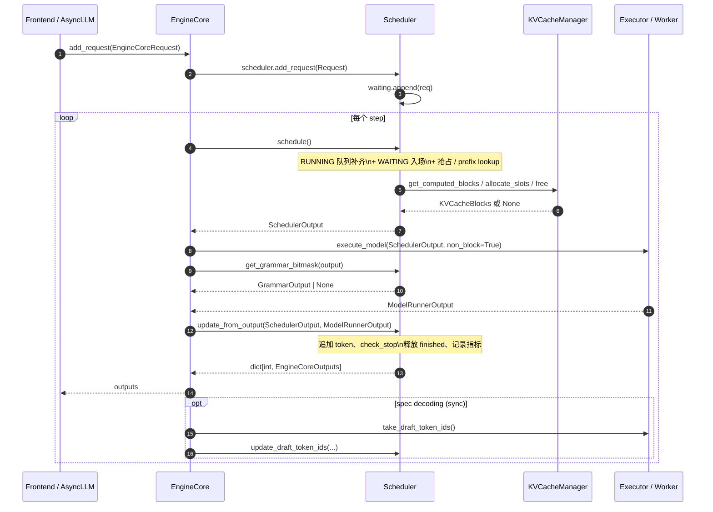

# 第 4 章 V1 调度器

本章只覆盖 V1 架构下的调度器实现，对应目录 `vllm/v1/core/sched/`。这是 vLLM 把 continuous batching、chunked prefill、prefix caching、speculative decoding、抢占与恢复融合在同一个循环里的核心。读完本章你应该能够：

- 说清楚一次 `schedule()` 调用从开始到结束做了哪些事；
- 看懂 `RUNNING` 队列与 `WAITING` 队列之间的状态迁移；
- 用 KV cache manager 的接口与 token budget 推导出某个 step 的 batch 形状；
- 解释 V0 与 V1 在调度抽象上的根本差异。

引用约定：`file:line` 指向 `/Users/xgliu/Documents/git/vllm/` 仓库内的具体行。

---

## 4.1 总览

### 4.1.1 目录结构

| 文件 | 行数 | 作用 |
| --- | --- | --- |
| `vllm/v1/core/sched/interface.py` | 245 | `SchedulerInterface` 抽象基类，定义引擎与调度器的契约 |
| `vllm/v1/core/sched/scheduler.py` | 2324 | `Scheduler` 主实现，包含 `schedule()`、`update_from_output()`、抢占、prefix cache 接入等 |
| `vllm/v1/core/sched/async_scheduler.py` | 61 | `AsyncScheduler` 子类，覆盖异步调度下的占位 token 簿记 |
| `vllm/v1/core/sched/output.py` | 264 | `SchedulerOutput`、`NewRequestData`、`CachedRequestData`、`GrammarOutput` |
| `vllm/v1/core/sched/request_queue.py` | 209 | `FCFSRequestQueue`、`PriorityRequestQueue` 与 `SchedulingPolicy` |
| `vllm/v1/core/sched/utils.py` | 131 | `check_stop`、`remove_all`、重复模式检测 |

调度器自身不持有任何 CUDA 资源，所有状态都是纯 Python 数据结构，便于在引擎进程里以同步方式运行。

### 4.1.2 EngineCore 与 Scheduler 的协作

`EngineCore` (`vllm/v1/engine/core.py:91`) 是 vLLM 的"内层循环宿主"。它持有一个 `SchedulerInterface` 与一个 `Executor`（多 worker 的代理），并以一个 `step()` 函数把两者编排起来：

```python
# vllm/v1/engine/core.py:425
def step(self) -> tuple[dict[int, EngineCoreOutputs], bool]:
    if not self.scheduler.has_requests():
        return {}, False
    scheduler_output = self.scheduler.schedule()
    future = self.model_executor.execute_model(scheduler_output, non_block=True)
    grammar_output = self.scheduler.get_grammar_bitmask(scheduler_output)
    with (
        self.log_error_detail(scheduler_output),
        self.log_iteration_details(scheduler_output),
    ):
        model_output = future.result()
        if model_output is None:
            model_output = self.model_executor.sample_tokens(grammar_output)
    self._process_aborts_queue()
    engine_core_outputs = self.scheduler.update_from_output(
        scheduler_output, model_output
    )
    return engine_core_outputs, scheduler_output.total_num_scheduled_tokens > 0
```

调度器与引擎的接触面（来自 `vllm/v1/core/sched/interface.py`）：

| 方法 | 何时被调用 | 关键产出 |
| --- | --- | --- |
| `add_request(request)` | 新请求到达时 | 把 `Request` 放入 `waiting` 或 `skipped_waiting` |
| `schedule()` | 每个 step 起点 | `SchedulerOutput`：本 step 跑哪些 req、各跑几个 token、新分配的 block id |
| `get_grammar_bitmask(output)` | execute 与 sample 之间 | `GrammarOutput`：结构化输出的合法 token 掩码 |
| `update_from_output(out, runner_out)` | 拿到 worker 返回后 | 累加生成的 token、释放/标记完成、产出 `EngineCoreOutputs` |
| `update_draft_token_ids(...)` | spec decode 起草后 | 把下一步要校验的 draft token id 写回 `Request.spec_token_ids` |
| `finish_requests(...)` | 客户端 abort / 停止串匹配 | 在 `running` 与 `waiting` 中删除并触发 KV 释放 |

### 4.1.3 每个 step 的输入输出

一次完整循环的数据流可以画作：

<svg viewBox="0 0 760 540" xmlns="http://www.w3.org/2000/svg" class="figure-svg" role="img" aria-label="EngineCore.step 一次完整循环：Scheduler ↔ Executor 间的数据流">
  <defs>
    <marker id="ch4ar1" viewBox="0 0 10 10" refX="9" refY="5" markerWidth="7" markerHeight="7" orient="auto">
      <path d="M0,0 L10,5 L0,10 z" fill="#94a3b8"/>
    </marker>
  </defs>
  <text x="380" y="20" text-anchor="middle" font-size="13" font-weight="600" fill="currentColor">EngineCore.step：scheduler 与 executor 之间的两个数据包</text>
  <g transform="translate(180, 40)">
    <rect x="0" y="0" width="400" height="40" fill="#fed7aa" stroke="#ea580c" stroke-width="1.5" rx="6"/>
    <text x="200" y="18" text-anchor="middle" font-size="13" font-weight="700" fill="#7c2d12">EngineCore.step</text>
    <text x="200" y="32" text-anchor="middle" font-size="10" fill="#9a3412">vllm/v1/engine/core.py:425</text>
  </g>
  <path d="M 380 80 L 380 110" fill="none" stroke="#94a3b8" stroke-width="1.4" marker-end="url(#ch4ar1)"/>
  <text x="395" y="100" font-size="10" fill="#64748b" font-style="italic">scheduler.schedule()  （纯 Python，无 GPU 工作）</text>
  <g transform="translate(100, 116)">
    <rect x="0" y="0" width="560" height="135" fill="#fef3c7" stroke="#f59e0b" stroke-width="1.5" rx="6"/>
    <text x="280" y="20" text-anchor="middle" font-size="13" font-weight="700" fill="#78350f">SchedulerOutput</text>
    <text x="280" y="34" text-anchor="middle" font-size="10" fill="#92400e">vllm/v1/core/sched/output.py</text>
    <g font-family="monospace" font-size="10.5" fill="#78350f">
      <text x="14" y="56">scheduled_new_reqs:    list[NewRequestData]</text>
      <text x="14" y="72">scheduled_cached_reqs: CachedRequestData</text>
      <text x="14" y="88">num_scheduled_tokens:  dict[str, int]</text>
      <text x="14" y="104">scheduled_spec_decode_tokens</text>
      <text x="14" y="120">scheduled_encoder_inputs</text>
      <text x="294" y="56">num_common_prefix_blocks</text>
      <text x="294" y="72">finished_req_ids</text>
      <text x="294" y="88">free_encoder_mm_hashes</text>
      <text x="294" y="104">kv_connector_metadata</text>
      <text x="294" y="120">grammar_bitmask (later)</text>
    </g>
  </g>
  <path d="M 380 251 L 380 285" fill="none" stroke="#94a3b8" stroke-width="1.4" marker-end="url(#ch4ar1)"/>
  <text x="395" y="275" font-size="10" fill="#64748b" font-style="italic">model_executor.execute_model(..., non_block=True)</text>
  <g transform="translate(100, 292)">
    <rect x="0" y="0" width="560" height="125" fill="#ddd6fe" stroke="#7c3aed" stroke-width="1.5" rx="6"/>
    <text x="280" y="20" text-anchor="middle" font-size="13" font-weight="700" fill="#4c1d95">ModelRunnerOutput</text>
    <text x="280" y="34" text-anchor="middle" font-size="10" fill="#5b21b6">vllm/v1/outputs.py:233</text>
    <g font-family="monospace" font-size="10.5" fill="#4c1d95">
      <text x="14" y="56">req_ids / req_id_to_index</text>
      <text x="14" y="72">sampled_token_ids</text>
      <text x="14" y="88">logprobs / prompt_logprobs_dict</text>
      <text x="14" y="104">pooler_output / kv_connector_output</text>
      <text x="294" y="56">num_nans_in_logits</text>
      <text x="294" y="72">routed_experts</text>
      <text x="294" y="88">finished_sending / recving</text>
      <text x="294" y="104">draft_token_ids (spec decode)</text>
    </g>
  </g>
  <path d="M 380 417 L 380 450" fill="none" stroke="#94a3b8" stroke-width="1.4" marker-end="url(#ch4ar1)"/>
  <text x="395" y="440" font-size="10" fill="#64748b" font-style="italic">scheduler.update_from_output(...)</text>
  <g transform="translate(200, 458)">
    <rect x="0" y="0" width="360" height="48" fill="#99f6e4" stroke="#0d9488" stroke-width="1.5" rx="6"/>
    <text x="180" y="20" text-anchor="middle" font-size="12" font-weight="700" fill="#134e4a">dict[int, EngineCoreOutputs]</text>
    <text x="180" y="36" text-anchor="middle" font-size="11" fill="#115e59">→ AsyncLLM / 前端进程</text>
  </g>
  <text x="40" y="180" font-size="10" fill="#64748b" font-style="italic">输入：调度</text>
  <text x="40" y="194" font-size="10" fill="#64748b" font-style="italic">决策表</text>
  <text x="40" y="350" font-size="10" fill="#64748b" font-style="italic">输出：模型</text>
  <text x="40" y="364" font-size="10" fill="#64748b" font-style="italic">前向结果</text>
  <g transform="translate(40, 525)">
    <text x="0" y="0" font-size="10" fill="#94a3b8" font-style="italic">schedule() 和 update_from_output() 都是纯 CPU 步骤；中间的 execute_model 才把张量推上 GPU。</text>
  </g>
</svg>
<span class="figure-caption">图 R4.1 ｜ 一次 EngineCore.step 的数据流：scheduler 输出 SchedulerOutput（调度决策表）→ executor 跑 forward → 返回 ModelRunnerOutput（采样结果）→ update_from_output 转成 EngineCoreOutputs</span>

<details>
<summary>ASCII 原版</summary>

```
            ┌─────────────────────────────────────────────────────┐
            │                  EngineCore.step                    │
            └─────────────────────────────────────────────────────┘
                              │
        scheduler.schedule()  │  (Python only, no GPU work)
                              ▼
        ┌─────────────────────────────────────────────┐
        │ SchedulerOutput                             │
        │   scheduled_new_reqs:    list[NewRequestData] │
        │   scheduled_cached_reqs: CachedRequestData    │
        │   num_scheduled_tokens:  dict[str,int]        │
        │   scheduled_spec_decode_tokens                │
        │   scheduled_encoder_inputs                    │
        │   num_common_prefix_blocks                    │
        │   finished_req_ids / free_encoder_mm_hashes   │
        │   kv_connector_metadata                       │
        └─────────────────────────────────────────────┘
                              │
        model_executor.execute_model(..., non_block=True)
                              ▼
        ┌─────────────────────────────────────────────┐
        │ ModelRunnerOutput (vllm/v1/outputs.py:233)   │
        │   req_ids / req_id_to_index                   │
        │   sampled_token_ids                           │
        │   logprobs / prompt_logprobs_dict             │
        │   pooler_output / kv_connector_output         │
        │   num_nans_in_logits / routed_experts ...     │
        └─────────────────────────────────────────────┘
                              │
        scheduler.update_from_output(...)
                              ▼
        dict[int, EngineCoreOutputs]  ──►  AsyncLLM/前端
```

</details>

`schedule()` 与 `update_from_output()` 都是纯 CPU 操作，但合起来构成一次"迭代"的所有外部可见副作用：分配/释放 KV block、把 token 追加到请求、判定停止、抢占。

### 4.1.4 与 V0 的根本差异

| 维度 | V0 (`vllm/core/scheduler.py`) | V1 (`vllm/v1/core/sched/scheduler.py`) |
| --- | --- | --- |
| 调度粒度 | 显式区分 prefill 与 decode 阶段，分别走两条函数 (`_schedule_prefills`, `_schedule_running`) | 没有 prefill/decode 概念，只有 `num_computed_tokens` 与 `num_tokens_with_spec`，由"补齐"逻辑自然涵盖所有形态 |
| 数据传输 | 每 step 重新序列化 `SequenceGroupMetadata` 到 worker | 区分 `NewRequestData` (一次性下发) 与 `CachedRequestData` (只发 diff)，worker 自行维护持久状态 |
| Block 分配 | `BlockSpaceManager` 单独走 swap/free | `KVCacheManager` 统一抽象 prefix cache、sliding window、cross attention，调度器只调用 `allocate_slots`/`get_computed_blocks`/`free` |
| 抢占 | recompute 与 swap 两种策略 | 仅 recompute，被抢占请求直接回到 `waiting` 队头 |
| 异步 | 同步 step | `AsyncScheduler` + `num_output_placeholders` 簿记，让 schedule 与 model forward 并行（见 §4.10） |
| Spec decode | 后挂在 sampler 上 | `num_lookahead_tokens` 在 KV 分配时即纳入考量，`scheduled_spec_decode_tokens` 进入 `SchedulerOutput` |
| 多模态 | 全 token 一次性 prefill | encoder 计算独立 budget (`max_num_encoder_input_tokens`) 与缓存 (`EncoderCacheManager`)，可与 decoder chunked prefill 错位调度 |

V1 的设计目标是"一切都是补齐 `num_tokens` 与 `num_computed_tokens` 之间的缺口"。这个统一抽象让 `schedule()` 主循环本身只有约 200 行（`scheduler.py:329-922`），却覆盖了 V0 中分散在多个分支里的全部场景。

---

## 4.2 核心数据结构

### 4.2.1 `Request` 与状态机

`Request` 定义在 `vllm/v1/request.py:59`，是调度器内的唯一请求对象。关键字段：

| 字段 | 含义 |
| --- | --- |
| `status: RequestStatus` | 当前阶段，决定它在哪个队列里 |
| `num_prompt_tokens` | 输入 prompt 长度 |
| `_all_token_ids` | prompt + 已生成的 output（追加式 `list[int]`） |
| `num_computed_tokens` | 截至本 step 之前已经被模型"处理过"的 token 数量 |
| `spec_token_ids` | 由 draft 模型/EAGLE 产出的、尚未校验的推测 token |
| `num_tokens_with_spec` | `len(_all_token_ids) + len(spec_token_ids)`，调度器要补齐的目标 |
| `block_hashes` | prefix caching 用的逐 block 哈希 |
| `priority`, `arrival_time` | 排序依据，`__lt__` 在 `request.py:302` |
| `num_output_placeholders` | 异步调度时，已 schedule 但尚未拿到结果的 token 数（见 §4.10） |
| `num_preemptions` | 被抢占的累积次数，可作为延迟/重试指标 |

状态枚举在 `vllm/v1/request.py:316`：

```python
class RequestStatus(enum.IntEnum):
    WAITING = enum.auto()
    WAITING_FOR_STRUCTURED_OUTPUT_GRAMMAR = enum.auto()
    WAITING_FOR_REMOTE_KVS = enum.auto()
    WAITING_FOR_STREAMING_REQ = enum.auto()
    RUNNING = enum.auto()
    PREEMPTED = enum.auto()
    # Note: anything after PREEMPTED will be considered as a finished status.
    FINISHED_STOPPED = enum.auto()
    FINISHED_LENGTH_CAPPED = enum.auto()
    FINISHED_ABORTED = enum.auto()
    FINISHED_IGNORED = enum.auto()
    FINISHED_ERROR = enum.auto()
    FINISHED_REPETITION = enum.auto()
```

`is_finished` 通过 `status > PREEMPTED` 一次比较判定（`request.py:337`）。三个 `WAITING_FOR_*` 状态被统称为"blocked waiting"，由 `Scheduler._is_blocked_waiting_status` 识别后放进 `skipped_waiting` 队列（`scheduler.py:1605`）。

状态迁移：

<svg viewBox="0 0 760 380" xmlns="http://www.w3.org/2000/svg" class="figure-svg" role="img" aria-label="Request 状态机：WAITING → RUNNING → FINISHED 与 PREEMPTED 回路">
  <defs>
    <marker id="ch4ar2" viewBox="0 0 10 10" refX="9" refY="5" markerWidth="7" markerHeight="7" orient="auto">
      <path d="M0,0 L10,5 L0,10 z" fill="#94a3b8"/>
    </marker>
    <marker id="ch4ar2r" viewBox="0 0 10 10" refX="9" refY="5" markerWidth="7" markerHeight="7" orient="auto">
      <path d="M0,0 L10,5 L0,10 z" fill="#dc2626"/>
    </marker>
  </defs>
  <text x="380" y="20" text-anchor="middle" font-size="13" font-weight="600" fill="currentColor">Request 状态机：WAITING / RUNNING / PREEMPTED / FINISHED_*</text>
  <g transform="translate(310, 45)">
    <ellipse cx="70" cy="14" rx="56" ry="14" fill="#f1f5f9" stroke="#94a3b8"/>
    <text x="70" y="18" text-anchor="middle" font-size="11" font-weight="600" fill="#475569">add_request()</text>
  </g>
  <path d="M 380 73 L 380 95" fill="none" stroke="#94a3b8" stroke-width="1.4" marker-end="url(#ch4ar2)"/>
  <g transform="translate(40, 100)">
    <rect x="0" y="0" width="320" height="110" fill="#fed7aa" stroke="#ea580c" stroke-width="1.5" rx="6"/>
    <text x="160" y="22" text-anchor="middle" font-size="13" font-weight="700" fill="#7c2d12">WAITING / WAITING_FOR_*</text>
    <line x1="14" y1="32" x2="306" y2="32" stroke="#fdba74"/>
    <text x="14" y="50" font-size="10.5" fill="#7c2d12">WAITING</text>
    <text x="14" y="66" font-size="10.5" fill="#7c2d12">WAITING_FOR_STRUCTURED_OUTPUT_GRAMMAR</text>
    <text x="14" y="82" font-size="10.5" fill="#7c2d12">WAITING_FOR_REMOTE_KVS</text>
    <text x="14" y="98" font-size="10.5" fill="#7c2d12">WAITING_FOR_STREAMING_REQ</text>
  </g>
  <g transform="translate(540, 105)">
    <rect x="-12" y="-8" width="180" height="36" fill="#fef3c7" stroke="#facc15" stroke-width="1" rx="4"/>
    <text x="78" y="6" text-anchor="middle" font-size="10" font-weight="600" fill="#78350f">_is_blocked_waiting_status</text>
    <text x="78" y="20" text-anchor="middle" font-size="10" fill="#92400e">→ skipped_waiting 队列</text>
  </g>
  <path d="M 360 130 Q 460 130 540 120" fill="none" stroke="#94a3b8" stroke-width="1.2" stroke-dasharray="3,2" marker-end="url(#ch4ar2)"/>
  <path d="M 540 150 Q 460 180 360 165" fill="none" stroke="#94a3b8" stroke-width="1.2" stroke-dasharray="3,2" marker-end="url(#ch4ar2)"/>
  <text x="450" y="195" text-anchor="middle" font-size="9" fill="#64748b" font-style="italic">grammar 就绪 / KV recv 完成</text>
  <path d="M 200 211 L 200 244" fill="none" stroke="#0d9488" stroke-width="1.4" marker-end="url(#ch4ar2)"/>
  <text x="210" y="232" font-size="10" font-weight="600" fill="#115e59">schedule(): allocate_slots OK</text>
  <g transform="translate(40, 250)">
    <rect x="0" y="0" width="320" height="56" fill="#99f6e4" stroke="#0d9488" stroke-width="1.5" rx="6"/>
    <text x="160" y="22" text-anchor="middle" font-size="13" font-weight="700" fill="#134e4a">RUNNING</text>
    <text x="160" y="42" text-anchor="middle" font-size="11" fill="#115e59">scheduler.running 列表（按调度顺序）</text>
  </g>
  <g transform="translate(440, 250)">
    <rect x="0" y="0" width="280" height="56" fill="#fef2f2" stroke="#dc2626" stroke-width="1.5" rx="6"/>
    <text x="140" y="22" text-anchor="middle" font-size="13" font-weight="700" fill="#991b1b">PREEMPTED</text>
    <text x="140" y="42" text-anchor="middle" font-size="11" fill="#7f1d1d">重新放回 waiting 队头</text>
  </g>
  <path d="M 360 268 L 437 268" fill="none" stroke="#dc2626" stroke-width="1.4" marker-end="url(#ch4ar2r)"/>
  <text x="398" y="262" text-anchor="middle" font-size="10" font-weight="600" fill="#dc2626">KV 不够</text>
  <path d="M 580 250 Q 580 218 400 218 Q 280 218 220 250" fill="none" stroke="#dc2626" stroke-width="1.2" stroke-dasharray="4,3" marker-end="url(#ch4ar2r)"/>
  <text x="420" y="212" text-anchor="middle" font-size="9" fill="#991b1b" font-style="italic">recompute（V1 仅此一种）</text>
  <path d="M 200 306 L 200 334" fill="none" stroke="#94a3b8" stroke-width="1.4" marker-end="url(#ch4ar2)"/>
  <text x="210" y="324" font-size="10" font-weight="600" fill="#475569">check_stop / abort / EOS</text>
  <g transform="translate(40, 340)">
    <rect x="0" y="0" width="320" height="34" fill="#f3f4f6" stroke="#64748b" stroke-width="1.5" rx="6"/>
    <text x="160" y="22" text-anchor="middle" font-size="12" font-weight="700" fill="#1f2937">FINISHED_STOPPED / LENGTH_CAPPED / ABORTED / ERROR / ...</text>
  </g>
</svg>
<span class="figure-caption">图 R4.2 ｜ Request 状态机：WAITING（含 3 个 blocked 子状态）→ RUNNING → FINISHED_*；KV 不够时 RUNNING 走 recompute 回路变 PREEMPTED 再插回 waiting 队头</span>

<details>
<summary>ASCII 原版</summary>

```
        add_request
             │
             ▼
   ┌───────────────────────────────────────────────────────┐
   │  WAITING (or WAITING_FOR_*)                           │
   │                                                       │
   │   ├── grammar 就绪 / KV recv 完成 ──► WAITING         │
   │   │                                                   │
   │   ▼ schedule(): allocate_slots OK                     │
   │  RUNNING                                              │
   │    │                                                  │
   │    ├── KV 不够 ──► PREEMPTED ──► waiting 队头           │
   │    │                                                  │
   │    ▼ check_stop / abort                               │
   │  FINISHED_*                                           │
   └───────────────────────────────────────────────────────┘
```

</details>

注意 `PREEMPTED` 与 `WAITING` 在 `request_queue.py` 里被统一塞回 `self.waiting`，但被抢占的请求在 `_make_cached_request_data` 中以 `resumed_req_ids` 区分（`scheduler.py:1050`），让 worker 知道要"替换 block_ids"而不是"追加"。

### 4.2.2 队列

```python
# vllm/v1/core/sched/scheduler.py:155
self.requests: dict[str, Request] = {}
self.policy = SchedulingPolicy(self.scheduler_config.policy)
self.waiting = create_request_queue(self.policy)         # FIFO 或 priority
self.skipped_waiting = create_request_queue(self.policy)  # blocked waiting
self.running: list[Request] = []                          # 严格按调度顺序
self.finished_req_ids: set[str] = set()                   # 上一 step 完成、需要在下一 step 通知 worker
```

两种队列实现都在 `request_queue.py`：

- `FCFSRequestQueue(deque[Request])`：`add_request` 追加到尾、`pop_request` 取头，复杂度 O(1)。
- `PriorityRequestQueue`：基于 `heapq` 的最小堆，比较键来自 `Request.__lt__`（`request.py:302`）：先比 `priority`，再比 `arrival_time`，最后比 `request_id`。

`skipped_waiting` 用来托管暂时无法立即调度的 waiting 请求（如等待远端 KV、结构化输出语法未就绪）。它有自己的调度优先级合并规则，见 §4.8。

### 4.2.3 `SchedulerOutput`

```python
# vllm/v1/core/sched/output.py:180
@dataclass
class SchedulerOutput:
    scheduled_new_reqs: list[NewRequestData]
    scheduled_cached_reqs: CachedRequestData
    num_scheduled_tokens: dict[str, int]
    total_num_scheduled_tokens: int
    scheduled_spec_decode_tokens: dict[str, list[int]]
    scheduled_encoder_inputs: dict[str, list[int]]
    num_common_prefix_blocks: list[int]
    finished_req_ids: set[str]
    free_encoder_mm_hashes: list[str]
    preempted_req_ids: set[str] | None = None
    has_structured_output_requests: bool = False
    pending_structured_output_tokens: bool = False
    num_invalid_spec_tokens: dict[str, int] | None = None
    kv_connector_metadata: KVConnectorMetadata | None = None
    ec_connector_metadata: ECConnectorMetadata | None = None
    new_block_ids_to_zero: list[int] | None = None
```

设计要点：

- `scheduled_new_reqs` 包含 prompt、mm_features、sampling_params 等"重"数据，worker 只在请求第一次出现时收到这份载荷，之后用 `req_id` 索引即可（`output.py:30`）。
- `scheduled_cached_reqs` 只发 diff：哪些 req 在本 step 跑、追加了哪些 block、`num_computed_tokens` 更新到多少、是否是 `resumed`（被抢占后恢复）。
- `num_scheduled_tokens` 是 worker 准备输入的根本依据：它告诉 worker 每个 req 这一步要喂多少 token；总和就是 batch token 总数。
- `num_common_prefix_blocks` 给 cascade attention 用，是 running 队列里所有请求共享前缀的 block 数。
- `finished_req_ids` 不是"这一步完成的"，而是"上一步完成、需要 worker 清理本地缓存的"——目的是让 worker 释放 `req_id -> block` 映射、PagedAttention 索引等。

### 4.2.4 `ModelRunnerOutput`

```python
# vllm/v1/outputs.py:233
@dataclass
class ModelRunnerOutput:
    req_ids: list[str]
    req_id_to_index: dict[str, int]
    sampled_token_ids: list[list[int]] = field(default_factory=list)
    logprobs: LogprobsLists | None = None
    prompt_logprobs_dict: dict[str, LogprobsTensors | None] = field(default_factory=dict)
    pooler_output: list[torch.Tensor | None] | None = None
    kv_connector_output: KVConnectorOutput | None = None
    ec_connector_output: ECConnectorOutput | None = None
    num_nans_in_logits: dict[str, int] | None = None
    cudagraph_stats: CUDAGraphStat | None = None
    routed_experts: RoutedExpertsLists | None = None
```

需要重点理解的两点：

1. `sampled_token_ids[i]` 是一个 `list[int]`，长度可以大于 1。对纯 decode 是 1，对 spec decoding 是接受的 token 数（可能直到 `num_spec_tokens+1`），对 chunked prefill 的非最终 chunk 通常是空 `[]`。
2. `req_id_to_index` 给出 worker 内部 `input_batch` 中的物理行号。调度器拿它把生成出来的 token 与 `Request` 对应起来（`scheduler.py:1363`）。

---

## 4.3 `schedule()` 算法主流程

`schedule()` 从 `scheduler.py:329` 开始，分成两个阶段：**先调度 RUNNING、再调度 WAITING**。每个阶段的内层循环都受 `token_budget` 约束。

### 4.3.1 顶层骨架（约 595 行 → 600 行附近的关键变量）

```python
# vllm/v1/core/sched/scheduler.py:341
scheduled_new_reqs:     list[Request] = []
scheduled_resumed_reqs: list[Request] = []
scheduled_running_reqs: list[Request] = []
preempted_reqs:         list[Request] = []
req_to_new_blocks:      dict[str, KVCacheBlocks] = {}
num_scheduled_tokens:   dict[str, int] = {}
token_budget = self.max_num_scheduled_tokens
```

`max_num_scheduled_tokens` 的初始值来自 `__init__`：

```python
# vllm/v1/core/sched/scheduler.py:104
self.max_num_scheduled_tokens = (
    self.scheduler_config.max_num_scheduled_tokens
    if self.scheduler_config.max_num_scheduled_tokens
    else self.scheduler_config.max_num_batched_tokens
)
```

也就是说，`max_num_batched_tokens` 是 token budget，`max_num_seqs` 是并发请求数上限：

```python
# vllm/v1/core/sched/scheduler.py:103
self.max_num_running_reqs = self.scheduler_config.max_num_seqs
```

### 4.3.2 第 1 阶段：RUNNING 队列

```python
# vllm/v1/core/sched/scheduler.py:365
req_index = 0
while req_index < len(self.running) and token_budget > 0:
    request = self.running[req_index]

    # (1) async 调度短路：如果这一步必定不再有 token，跳过
    if (request.num_output_placeholders > 0
        and request.num_computed_tokens + 2 - request.num_output_placeholders
            >= request.num_prompt_tokens + request.max_tokens):
        req_index += 1
        continue

    # (2) 计算要补齐多少 token
    num_new_tokens = (request.num_tokens_with_spec
                      + request.num_output_placeholders
                      - request.num_computed_tokens)
    if 0 < self.scheduler_config.long_prefill_token_threshold < num_new_tokens:
        num_new_tokens = self.scheduler_config.long_prefill_token_threshold
    num_new_tokens = min(num_new_tokens, token_budget)
    num_new_tokens = min(num_new_tokens,
                        self.max_model_len - 1 - request.num_computed_tokens)
```

关键洞察：调度器从不区分 prefill 与 decode。`num_new_tokens` 由三部分构成：

- `num_tokens_with_spec - num_computed_tokens`：还差多少 prompt+output+spec token 没"赶上"。
- `+ num_output_placeholders`：异步调度时上一步还在飞行中的 token 也算作"已计划"的。

`long_prefill_token_threshold` 是 chunked prefill 的关键旋钮（见 §4.5）；`max_model_len - 1` 用来防止 spec decoding 把位置算溢出。

```python
# vllm/v1/core/sched/scheduler.py:400
if request.has_encoder_inputs:
    (encoder_inputs_to_schedule, num_new_tokens,
     new_encoder_compute_budget, external_load_encoder_input) = \
        self._try_schedule_encoder_inputs(...)  # 见 §4.11

if self.need_mamba_block_aligned_split:
    num_new_tokens = self._mamba_block_aligned_split(request, num_new_tokens)

if num_new_tokens == 0:
    req_index += 1
    continue  # 注意：不是 break。允许低优先级请求"绕过"被阻塞的
```

注释里强调用 `continue` 而非 `break`：宁可不严格遵循 FCFS，也要让后面的请求有机会运行。

接下来是 KV block 分配 + 抢占循环：

```python
# vllm/v1/core/sched/scheduler.py:443
while True:
    new_blocks = self.kv_cache_manager.allocate_slots(
        request, num_new_tokens,
        num_lookahead_tokens=self.num_lookahead_tokens,
    )
    if new_blocks is not None:
        break  # 分配成功，跳出抢占循环
    # 失败：挑一个 victim 抢占
    if self.policy == SchedulingPolicy.PRIORITY:
        preempted_req = max(self.running, key=lambda r: (r.priority, r.arrival_time))
        self.running.remove(preempted_req)
        # 如果 victim 在本 step 已被排入 batch，撤销它（归还 budget）
        ...
    else:
        preempted_req = self.running.pop()  # FCFS：从队尾抢
    self._preempt_request(preempted_req, scheduled_timestamp)
    preempted_reqs.append(preempted_req)
    if preempted_req == request:
        break  # 没有比自己更低优先级的可抢了
```

PRIORITY 模式下还要额外回滚抢占目标在本 step 的 token 预算与 encoder budget（`scheduler.py:462-479`）。

排入 batch 后再处理 spec token 簿记和 encoder 缓存分配：

```python
# vllm/v1/core/sched/scheduler.py:494
scheduled_running_reqs.append(request)
req_to_new_blocks[request_id] = new_blocks
num_scheduled_tokens[request_id] = num_new_tokens
token_budget -= num_new_tokens

if request.spec_token_ids:
    num_scheduled_spec_tokens = (
        num_new_tokens + request.num_computed_tokens
        - request.num_tokens - request.num_output_placeholders)
    if num_scheduled_spec_tokens > 0:
        spec_token_ids = request.spec_token_ids[:num_scheduled_spec_tokens]
        scheduled_spec_decode_tokens[request.request_id] = spec_token_ids
    request.spec_token_ids = []
```

### 4.3.3 第 2 阶段：WAITING 队列

```python
# vllm/v1/core/sched/scheduler.py:545
if not preempted_reqs and self._pause_state == PauseState.UNPAUSED:
    step_skipped_waiting = create_request_queue(self.policy)
    while (self.waiting or self.skipped_waiting) and token_budget > 0:
        if len(self.running) == self.max_num_running_reqs:
            break
        request_queue = self._select_waiting_queue_for_scheduling()
        request = request_queue.peek_request()
        ...
```

**只在本 step 没有发生抢占时才考虑入新请求**。这是个保守策略：刚有抢占说明显存紧张，再放新请求只会增加抖动。

`_select_waiting_queue_for_scheduling`（`scheduler.py:1619`）在 FCFS 下偏好 `skipped_waiting`（最早被搁置的最先重试），在 PRIORITY 下比较两个队头的优先级。

阻塞状态促级尝试：

```python
# vllm/v1/core/sched/scheduler.py:559
if self._is_blocked_waiting_status(request.status) \
   and not self._try_promote_blocked_waiting_request(request):
    request_queue.pop_request()
    step_skipped_waiting.prepend_request(request)
    continue
```

`_try_promote_blocked_waiting_request`（`scheduler.py:2090`）会检查 KV 是否 recv 完、grammar 是否编译完，能促级就改 `status`，否则继续搁置。

prefix cache lookup（详见 §4.7）：

```python
# vllm/v1/core/sched/scheduler.py:591
if request.num_computed_tokens == 0:
    new_computed_blocks, num_new_local_computed_tokens = (
        self.kv_cache_manager.get_computed_blocks(request))
    if self.connector is not None:
        ext_tokens, load_kv_async = (
            self.connector.get_num_new_matched_tokens(
                request, num_new_local_computed_tokens))
        if ext_tokens is None:
            request_queue.pop_request()
            step_skipped_waiting.prepend_request(request)
            continue
        num_external_computed_tokens = ext_tokens
    num_computed_tokens = (num_new_local_computed_tokens
                           + num_external_computed_tokens)
```

随后是 chunked prefill 决策（`scheduler.py:654`）：

```python
num_new_tokens = request.num_tokens - num_computed_tokens
threshold = self.scheduler_config.long_prefill_token_threshold
if 0 < threshold < num_new_tokens:
    num_new_tokens = threshold
if (not self.scheduler_config.enable_chunked_prefill
    and num_new_tokens > token_budget):
    break  # 关闭 chunked prefill 时整个 prompt 必须一次性装下
num_new_tokens = min(num_new_tokens, token_budget)
```

最后是 KV 分配。注意 `full_sequence_must_fit=self.scheduler_reserve_full_isl` 这一项：

```python
# vllm/v1/core/sched/scheduler.py:721
new_blocks = self.kv_cache_manager.allocate_slots(
    request, num_new_tokens,
    num_new_computed_tokens=num_new_local_computed_tokens,
    new_computed_blocks=new_computed_blocks,
    num_lookahead_tokens=effective_lookahead_tokens,
    num_external_computed_tokens=num_external_computed_tokens,
    delay_cache_blocks=load_kv_async,
    num_encoder_tokens=num_encoder_tokens,
    full_sequence_must_fit=self.scheduler_reserve_full_isl,
)
```

`scheduler_reserve_full_isl`（`vllm/config/scheduler.py:140`）默认 True：在 chunked prefill 启用时，只允许"完整 ISL 都能塞下"的新请求入场，避免日后大量抢占。

把请求落到 RUNNING：

```python
# vllm/v1/core/sched/scheduler.py:784
self.running.append(request)
if request.status == RequestStatus.WAITING:
    scheduled_new_reqs.append(request)
elif request.status == RequestStatus.PREEMPTED:
    scheduled_resumed_reqs.append(request)
...
request.status = RequestStatus.RUNNING
request.num_computed_tokens = num_computed_tokens
```

### 4.3.4 出口：构造 `SchedulerOutput`

```python
# vllm/v1/core/sched/scheduler.py:826
total_num_scheduled_tokens = sum(num_scheduled_tokens.values())
assert total_num_scheduled_tokens <= self.max_num_scheduled_tokens
assert token_budget >= 0
assert len(self.running) <= self.max_num_running_reqs

if self.running:
    num_common_prefix_blocks = (
        self.kv_cache_manager.get_num_common_prefix_blocks(
            self.running[0].request_id))
```

`_make_cached_request_data`（`scheduler.py:1036`）打包 running + resumed，区分 `resumed_req_ids`，并对那些"上一步没被调度的"额外把 `all_token_ids` 拷一份发回 worker（PP 与 connector 都会用到）。

`_update_after_schedule`（`scheduler.py:951`）在返回前就预先推进 `num_computed_tokens`，于是即便 model forward 还没结束，下一次 `schedule()` 也可以接着排同一个请求——这是异步调度（§4.10）的基础。

---

## 4.4 Continuous batching：迭代级而非请求级

V1 没有"等当前 batch 结束才接新请求"的概念。每个 `schedule()` 都重新决定 batch 形状：

1. RUNNING 队列里所有未补齐的 req 各分一段 token（多数情况下 decode 是 1，prefill chunk 是几百到几千）。
2. 只要还有 token budget 与 seq 空位，从 WAITING 拉新的进来。
3. 新请求落到 `scheduled_new_reqs`，worker 第一次见到它就 cache 住 prompt/sampling_params。
4. 老请求只发 `CachedRequestData`：仅 token 数、追加的 block_ids、是否 resumed。

这种"中途加入"零开销：worker 用 `req_id_to_index` 给每个 req 在持久化 `input_batch` 里分配一行，新请求只是 append，结束的就 free。worker 端的实现见 `vllm/v1/worker/gpu_model_runner.py`，但本章不展开。

ASCII 视角看一次包含混合 prefill+decode 的 step：

<svg viewBox="0 0 760 320" xmlns="http://www.w3.org/2000/svg" class="figure-svg" role="img" aria-label="一个 batch 同时容纳 prefill chunk、decode、spec decode 与 resumed prefill">
  <defs>
    <marker id="ch4ar3" viewBox="0 0 10 10" refX="9" refY="5" markerWidth="7" markerHeight="7" orient="auto">
      <path d="M0,0 L10,5 L0,10 z" fill="#94a3b8"/>
    </marker>
  </defs>
  <text x="380" y="20" text-anchor="middle" font-size="13" font-weight="600" fill="currentColor">一个 batch = prefill chunk + decode + spec decode + resumed prefill 同时存在</text>
  <text x="40" y="50" font-size="11" font-weight="600" fill="currentColor">running 列表 (4 个 req)</text>
  <g transform="translate(40, 60)">
    <rect x="0" y="0" width="320" height="22" fill="#ea580c"/>
    <text x="10" y="15" font-size="11" font-weight="600" fill="white">A · prefill chunk</text>
    <text x="310" y="15" text-anchor="end" font-size="10" font-weight="700" fill="white">256 tok</text>
  </g>
  <g transform="translate(40, 88)">
    <rect x="0" y="0" width="20" height="22" fill="#0d9488"/>
    <text x="30" y="15" font-size="11" font-weight="600" fill="#115e59">B · decode</text>
    <text x="172" y="15" text-anchor="end" font-size="10" font-weight="700" fill="#115e59">1 tok</text>
  </g>
  <g transform="translate(40, 116)">
    <rect x="0" y="0" width="20" height="22" fill="#0d9488"/>
    <rect x="22" y="0" width="60" height="22" fill="#7c3aed" opacity="0.85"/>
    <text x="92" y="15" font-size="11" font-weight="600" fill="#115e59">C · decode 1 + spec 3</text>
    <text x="260" y="15" text-anchor="end" font-size="10" font-weight="700" fill="#115e59">= 4 tok</text>
  </g>
  <g transform="translate(40, 144)">
    <rect x="0" y="0" width="160" height="22" fill="#f59e0b"/>
    <text x="10" y="15" font-size="11" font-weight="600" fill="white">D · prefill resumed</text>
    <text x="200" y="15" font-size="10" font-weight="700" fill="#92400e">128 tok</text>
  </g>
  <g transform="translate(390, 60)">
    <rect x="0" y="0" width="14" height="110" fill="#fed7aa" stroke="#ea580c" stroke-width="1"/>
    <text x="22" y="62" font-size="11" font-weight="600" fill="#7c2d12">这 4 个 req 排进同一个 forward</text>
    <text x="22" y="80" font-size="11" font-weight="700" fill="#9a3412">num_scheduled_tokens = 390</text>
  </g>
  <path d="M 380 180 L 380 210" fill="none" stroke="#94a3b8" stroke-width="1.4" marker-end="url(#ch4ar3)"/>
  <text x="395" y="200" font-size="11" font-style="italic" fill="#475569">model forward(390 tokens)</text>
  <g transform="translate(40, 220)">
    <rect x="0" y="0" width="680" height="80" fill="#f0fdf4" stroke="#16a34a" stroke-width="1.5" rx="6"/>
    <text x="340" y="20" text-anchor="middle" font-size="12" font-weight="700" fill="#166534">sampled_token_ids</text>
    <g font-family="monospace" font-size="11">
      <text x="14" y="42" fill="#475569"><tspan font-weight="700" fill="#ea580c">A →</tspan> []           <tspan fill="#94a3b8">// 还没 prefill 完，无新 token</tspan></text>
      <text x="14" y="58" fill="#475569"><tspan font-weight="700" fill="#0d9488">B →</tspan> [token]      <tspan fill="#94a3b8">// 正常 decode 出 1 个</tspan></text>
      <text x="360" y="42" fill="#475569"><tspan font-weight="700" fill="#0d9488">C →</tspan> [t1, t2]     <tspan fill="#94a3b8">// 接受 1 个 spec token</tspan></text>
      <text x="360" y="58" fill="#475569"><tspan font-weight="700" fill="#f59e0b">D →</tspan> []           <tspan fill="#94a3b8">// 仍是 prefill，无 sample</tspan></text>
    </g>
  </g>
</svg>
<span class="figure-caption">图 R4.3 ｜ 一个 batch 内 prefill chunk、decode、spec-decode、resumed prefill 四种形态共存：scheduler 只需把 num_scheduled_tokens 凑齐 token budget（390），由 worker 用 query_start_loc 自然区分各 req</span>

<details>
<summary>ASCII 原版</summary>

```
 running:  A(prefill chunk 256)    │
           B(decode 1)             │  这 4 个 req 排进同一个 forward
           C(decode 1+spec3=4)     │
           D(prefill resumed 128)  │
                                   │
 num_scheduled_tokens = 390        ▼ batch token = 390
 model forward(...) ────► sampled_token_ids
   A → []           # 还没 prefill 完
   B → [token]
   C → [t1, t2]    # 接受了 1 个 spec token
   D → []
```

</details>

---

## 4.5 Chunked prefill

### 4.5.1 触发条件

```python
# vllm/config/scheduler.py:84
enable_chunked_prefill: bool = True
long_prefill_token_threshold: int = 0  # 自动: max_model_len * 0.04
```

`long_prefill_token_threshold` 的自动值由 `SchedulerConfig.__post_init__` 计算（`vllm/config/scheduler.py:245`）。它把"每个 step 单个 prompt 最多 prefill 多少 token"封顶。

### 4.5.2 切块逻辑

WAITING 分支里：

```python
# vllm/v1/core/sched/scheduler.py:654
num_new_tokens = request.num_tokens - num_computed_tokens
threshold = self.scheduler_config.long_prefill_token_threshold
if 0 < threshold < num_new_tokens:
    num_new_tokens = threshold
if (not self.scheduler_config.enable_chunked_prefill
    and num_new_tokens > token_budget):
    break          # 关闭分块时，prompt 一次塞不下就让位
num_new_tokens = min(num_new_tokens, token_budget)
```

RUNNING 分支里也有镜像逻辑：

```python
# vllm/v1/core/sched/scheduler.py:390
if 0 < self.scheduler_config.long_prefill_token_threshold < num_new_tokens:
    num_new_tokens = self.scheduler_config.long_prefill_token_threshold
num_new_tokens = min(num_new_tokens, token_budget)
```

由此自然推出"chunked prefill + decode 混合"的现象：长 prompt 每次切走一块，剩余 budget 喂给 decode；下一步还是同一个 req，但 `num_computed_tokens` 已经推进了一段。

### 4.5.3 是否最终 chunk

`_update_after_schedule` 设置标志：

```python
# vllm/v1/core/sched/scheduler.py:965
request.is_prefill_chunk = request.num_computed_tokens < (
    request.num_tokens + request.num_output_placeholders)
scheduler_output.has_structured_output_requests |= (
    request.use_structured_output and not request.is_prefill_chunk)
```

`is_prefill_chunk == True` 表示这一 step 是非最终 prefill chunk，对应的：

- 不需要 sample（worker 不返回 token）。
- 不应用 grammar 约束（`get_grammar_bitmask` 与 `update_draft_token_ids` 都会跳过）。

### 4.5.4 admission gate：`scheduler_reserve_full_isl`

```python
# vllm/config/scheduler.py:140
scheduler_reserve_full_isl: bool = True
```

调度器在 WAITING → RUNNING 时把它传给 `allocate_slots`：

```python
# vllm/v1/core/kv_cache_manager.py:346
if full_sequence_must_fit:
    full_num_tokens = min(request.num_tokens, self.max_model_len)
    num_blocks_to_allocate = self.coordinator.get_num_blocks_to_allocate(...)
    if num_blocks_to_allocate > self.block_pool.get_num_free_blocks():
        return None
```

不开这个 gate 的话，chunked prefill 只检查第一块是否有空间，可能让请求"勉强进来"然后在后续 chunk 被反复抢占。

---

## 4.6 抢占（preemption）

### 4.6.1 触发位置

只在 RUNNING 阶段、`allocate_slots` 返回 `None` 时发生（`scheduler.py:443-491`）。被抢占目标的挑选：

- FCFS：`self.running.pop()`，即新进 batch 的（"最年轻的"）。
- PRIORITY：`max(self.running, key=lambda r: (r.priority, r.arrival_time))`，即最低优先级里最晚到的。

### 4.6.2 抢占动作

```python
# vllm/v1/core/sched/scheduler.py:929
def _preempt_request(self, request: Request, timestamp: float) -> None:
    assert request.status == RequestStatus.RUNNING
    self.kv_cache_manager.free(request)        # 释放所有 KV block
    self.encoder_cache_manager.free(request)
    request.status = RequestStatus.PREEMPTED
    request.num_computed_tokens = 0            # 完全归零
    if request.spec_token_ids:
        request.spec_token_ids = []
    request.num_preemptions += 1
    if self.log_stats:
        request.record_event(EngineCoreEventType.PREEMPTED, timestamp)
    self.waiting.prepend_request(request)      # 回到队头，下一 step 优先
```

注意：**V1 只支持 recompute**，没有 swap-to-CPU。`num_computed_tokens = 0` 表示放弃所有中间态，恢复时通过 prefix caching 再把已经 cache 的前缀拿回来（如果还在 GPU 上）。

### 4.6.3 PRIORITY 模式下的回滚

PRIORITY 模式下，被抢占目标可能已经在本 step 排进了 batch，需要把它从 `scheduled_running_reqs`、`num_scheduled_tokens`、`req_to_new_blocks`、`scheduled_spec_decode_tokens`、`scheduled_encoder_inputs` 等所有结构里清掉，并归还 `token_budget` 与 `encoder_compute_budget`（`scheduler.py:462-479`）。这是 V1 实现里少有的回滚式逻辑。

### 4.6.4 恢复时的 `resumed_req_ids`

抢占后的请求再次被调度时，`scheduled_resumed_reqs.append(request)`（`scheduler.py:791`）。在 `_make_cached_request_data` 中：

```python
# vllm/v1/core/sched/scheduler.py:1073
if idx >= num_running_reqs:
    assert not scheduled_in_prev_step
    resumed_req_ids.add(req_id)
```

worker 收到 `CachedRequestData` 后，对 `resumed_req_ids` 中的 req 用新的 `new_block_ids` **替换**原来的 block 表，而不是追加。`output.py:117` 的注释解释了这一约定。

---

## 4.7 Prefix caching 在调度中的角色

### 4.7.1 触发点：只对 `num_computed_tokens == 0` 的请求

```python
# vllm/v1/core/sched/scheduler.py:591
if request.num_computed_tokens == 0:
    new_computed_blocks, num_new_local_computed_tokens = (
        self.kv_cache_manager.get_computed_blocks(request))
```

也就是说，prefix lookup **只在一个请求从 WAITING 第一次进 RUNNING 时进行**。被抢占后再恢复的请求 (`PREEMPTED`) 也属于 `num_computed_tokens == 0`，因此也能复用 prefix cache（如果未被驱逐）。

### 4.7.2 `get_computed_blocks` 的关键代码

```python
# vllm/v1/core/kv_cache_manager.py:194
def get_computed_blocks(self, request: Request) -> tuple[KVCacheBlocks, int]:
    if not self.enable_caching or request.skip_reading_prefix_cache:
        return self.empty_kv_cache_blocks, 0
    # 必须留至少 1 个 token 给采样，否则没有 logits
    max_cache_hit_length = request.num_tokens - 1
    computed_blocks, num_new_computed_tokens = (
        self.coordinator.find_longest_cache_hit(
            request.block_hashes, max_cache_hit_length))
    ...
    return self.create_kv_cache_blocks(computed_blocks), num_new_computed_tokens
```

`block_hashes` 在 `Request.update_block_hashes()` 中按 `hash_block_size` 增量计算（`request.py:230`）。每次 prefix 命中跳过的是完整 block。

### 4.7.3 调度链路如何用上命中

1. `num_new_local_computed_tokens` 被加入 `num_computed_tokens`，于是 `num_new_tokens = request.num_tokens - num_computed_tokens` 自动变小。
2. `allocate_slots` 收到 `new_computed_blocks` 参数，会把这些 block ref count++ 并挂到该请求名下，而不重新分配（`kv_cache_manager.py:391-403`）。
3. 在 worker 看来，请求第一次出现时携带的 `block_ids` 已经包含了命中部分，不需要额外做"先 prefill cache 部分"的步骤。

### 4.7.4 外部 cache（KV connector）

```python
# vllm/v1/core/sched/scheduler.py:598
if self.connector is not None:
    ext_tokens, load_kv_async = (
        self.connector.get_num_new_matched_tokens(
            request, num_new_local_computed_tokens))
```

如果 connector 报告"我有一段更长的命中，但需要异步传过来"，调度器会把请求标记为 `WAITING_FOR_REMOTE_KVS` 并搁置（`scheduler.py:763`）。下一 step 通过 `_try_promote_blocked_waiting_request` 检查是否 recv 完成（`scheduler.py:2094`）。

---

## 4.8 调度策略

### 4.8.1 内置策略

```python
# vllm/v1/core/sched/request_queue.py:13
class SchedulingPolicy(Enum):
    FCFS = "fcfs"
    PRIORITY = "priority"
```

策略来自 `SchedulerConfig.policy`（`vllm/config/scheduler.py:109`）。

### 4.8.2 `_select_waiting_queue_for_scheduling`

```python
# vllm/v1/core/sched/scheduler.py:1619
def _select_waiting_queue_for_scheduling(self) -> RequestQueue | None:
    if self.policy == SchedulingPolicy.FCFS:
        return self.skipped_waiting or self.waiting or None
    # PRIORITY mode: compare queue heads when both queues are non-empty.
    if self.waiting and self.skipped_waiting:
        waiting_req = self.waiting.peek_request()
        skipped_req = self.skipped_waiting.peek_request()
        return self.waiting if waiting_req < skipped_req else self.skipped_waiting
    return self.waiting or self.skipped_waiting or None
```

FCFS 下优先消费 `skipped_waiting`（最早被搁置的优先），可以减少结构化输出/远端 KV 请求被饿死的概率。

### 4.8.3 自定义调度器

`scheduler_cls: str | type[object] | None` (`vllm/config/scheduler.py:127`) 允许把整个 `Scheduler` 替换成自定义子类，例如 SLA-aware、能感知 batch shape 的策略。V1 本身没有内置 SLA 调度器。

### 4.8.4 暂停态

```python
# vllm/v1/core/sched/interface.py:22
class PauseState(enum.IntEnum):
    UNPAUSED = 0
    PAUSED_NEW = 1    # 老的继续跑，新的不接
    PAUSED_ALL = 2    # 全停
```

`schedule()` 在两处响应：开头把 `token_budget` 清零（PAUSED_ALL）、WAITING 阶段判断 `_pause_state == UNPAUSED`（`scheduler.py:545`）。`get_num_unfinished_requests` 也会按暂停态调整（`scheduler.py:1872`）。

---

## 4.9 与 KV cache manager 的交互

调度器只通过少量方法接触 `KVCacheManager`（`vllm/v1/core/kv_cache_manager.py`）：

| 方法 | 调用点 | 说明 |
| --- | --- | --- |
| `new_step_starts()` | `scheduler.py:362` | step 起点清理瞬时状态 |
| `get_computed_blocks(req)` | `scheduler.py:594` | prefix lookup，返回命中 block 与 token 数 |
| `allocate_slots(req, ..., full_sequence_must_fit=...)` | RUNNING `:444` / WAITING `:721` | 分配 block；失败返回 `None` 触发抢占 |
| `free(req)` | `scheduler.py:938`, `_free_blocks` `:1860` | 释放 |
| `get_blocks(req_id)` / `get_block_ids(req_id)` | `scheduler.py:798`, `:2044` | 查询当前持有的 block |
| `cache_blocks(req, n)` | 异步调度场景 `async_scheduler.py:57` | 把指定数量 token 对应的 block 提交到 prefix cache |
| `get_num_common_prefix_blocks(req_id)` | `scheduler.py:845` | 给 cascade attention 用 |
| `take_events()` | `scheduler.py:1554` | 收集 KV 事件（用于 KV event 总线） |
| `take_new_block_ids()` | `scheduler.py:882` | mamba 等需要清零的场景使用 |
| `reset_prefix_cache()` | `scheduler.py:1919` | 模型权重热更新时清空 prefix cache |

`allocate_slots` 的 block 布局图很说明问题：

<svg viewBox="0 0 760 320" xmlns="http://www.w3.org/2000/svg" class="figure-svg" role="img" aria-label="allocate_slots 的五段 token 布局：comp / new_comp / ext_comp / new / lookahead">
  <defs>
    <marker id="ch4ar4" viewBox="0 0 10 10" refX="9" refY="5" markerWidth="6" markerHeight="6" orient="auto">
      <path d="M0,0 L10,5 L0,10 z" fill="#94a3b8"/>
    </marker>
  </defs>
  <text x="380" y="20" text-anchor="middle" font-size="13" font-weight="600" fill="currentColor">一次 allocate_slots 看到的 token 五段视图</text>
  <g transform="translate(60, 50)">
    <rect x="0" y="0" width="120" height="40" fill="#e2e8f0" stroke="#94a3b8"/>
    <text x="60" y="18" text-anchor="middle" font-size="11" font-weight="700" fill="#334155">comp</text>
    <text x="60" y="32" text-anchor="middle" font-size="9" fill="#475569">已计算 + 已有 block</text>
    <rect x="120" y="0" width="120" height="40" fill="#fed7aa" stroke="#ea580c"/>
    <text x="180" y="18" text-anchor="middle" font-size="11" font-weight="700" fill="#7c2d12">new_comp</text>
    <text x="180" y="32" text-anchor="middle" font-size="9" fill="#9a3412">prefix cache 新命中</text>
    <rect x="240" y="0" width="140" height="40" fill="#ddd6fe" stroke="#7c3aed"/>
    <text x="310" y="18" text-anchor="middle" font-size="11" font-weight="700" fill="#5b21b6">ext_comp</text>
    <text x="310" y="32" text-anchor="middle" font-size="9" fill="#4c1d95">外部 connector 提供</text>
    <rect x="380" y="0" width="140" height="40" fill="#99f6e4" stroke="#0d9488"/>
    <text x="450" y="18" text-anchor="middle" font-size="11" font-weight="700" fill="#134e4a">new</text>
    <text x="450" y="32" text-anchor="middle" font-size="9" fill="#115e59">本步要前向的 token</text>
    <rect x="520" y="0" width="120" height="40" fill="#fef3c7" stroke="#f59e0b"/>
    <text x="580" y="18" text-anchor="middle" font-size="11" font-weight="700" fill="#78350f">lookahead</text>
    <text x="580" y="32" text-anchor="middle" font-size="9" fill="#92400e">spec decoding 预留</text>
  </g>
  <g transform="translate(60, 105)">
    <line x1="380" y1="0" x2="380" y2="14" stroke="#16a34a" stroke-width="1.4"/>
    <line x1="380" y1="14" x2="640" y2="14" stroke="#16a34a" stroke-width="1.4"/>
    <line x1="640" y1="0" x2="640" y2="14" stroke="#16a34a" stroke-width="1.4"/>
    <text x="510" y="30" text-anchor="middle" font-size="11" font-weight="700" fill="#166534">to be computed</text>
    <text x="510" y="44" text-anchor="middle" font-size="9" fill="#15803d">新算 = new + lookahead</text>
  </g>
  <g transform="translate(60, 165)">
    <line x1="120" y1="0" x2="120" y2="14" stroke="#0ea5e9" stroke-width="1.4"/>
    <line x1="120" y1="14" x2="640" y2="14" stroke="#0ea5e9" stroke-width="1.4"/>
    <line x1="640" y1="0" x2="640" y2="14" stroke="#0ea5e9" stroke-width="1.4"/>
    <text x="380" y="30" text-anchor="middle" font-size="11" font-weight="700" fill="#0369a1">to be allocated</text>
    <text x="380" y="44" text-anchor="middle" font-size="9" fill="#075985">new_comp + ext_comp + new + lookahead</text>
  </g>
  <g transform="translate(60, 225)">
    <line x1="120" y1="0" x2="120" y2="14" stroke="#dc2626" stroke-width="1.4"/>
    <line x1="120" y1="14" x2="520" y2="14" stroke="#dc2626" stroke-width="1.4"/>
    <line x1="520" y1="0" x2="520" y2="14" stroke="#dc2626" stroke-width="1.4"/>
    <text x="320" y="30" text-anchor="middle" font-size="11" font-weight="700" fill="#991b1b">to be cached (roughly)</text>
    <text x="320" y="44" text-anchor="middle" font-size="9" fill="#7f1d1d">前缀对齐到 full block，lookahead 不缓存</text>
  </g>
  <g transform="translate(40, 290)">
    <text x="0" y="0" font-size="10" font-style="italic" fill="#94a3b8">注：调度器只管"段落划分"，块的实际分配/回收策略封装在 coordinator + block_pool。</text>
  </g>
</svg>
<span class="figure-caption">图 R4.4 ｜ allocate_slots 把一个 request 的 token 切成五段：已计算 / prefix 命中 / 外部 / 本步新算 / spec 预留；下方三个区间标出 "本步要算的"、"本步要分配的"、"本步要写入 prefix cache 的"</span>

<details>
<summary>ASCII 原版</summary>

```
┌──────────┬──────────────┬───────────────┬──────────┬───────────────┐
| < comp > | < new_comp > | < ext_comp >  | < new >  | < lookahead > |
└──────────┴──────────────┴───────────────┴──────────┴───────────────┘
                                          |   < to be computed >     |
                          |            < to be allocated >           |
                          |  < to be cached (roughly) >  |
```

</details>

`comp` = 已计算并已分配过 block 的 token；`new_comp` = 本 step 通过 prefix cache 新命中的 token；`ext_comp` = connector 提供的外部 KV；`new` = 本 step 要前向的 token（含未验证 draft）；`lookahead` = 给 spec decoding 预留的位置。

调度器**不直接管理 block pool 内部结构**，所有块分配/驱逐策略都封装在 `coordinator` / `block_pool` 里。这种解耦让调度器主循环可以保持纯 Python，且 prefix cache、sliding window、cross attention 的策略都能各自演进。

---

## 4.10 与 worker 的异步流水线

### 4.10.1 标准 sync 路径

`EngineCore.step` (`vllm/v1/engine/core.py:425`) 用 `non_block=True` 拿到一个 future，再立刻 `future.result()` 等待——本质上仍然是同步的。开启 async 调度之前的"非阻塞 execute_model"只是给后面的 batch_queue 路径预留接口。

### 4.10.2 `AsyncScheduler`

当 `scheduler_config.async_scheduling=True` 时，`SchedulerConfig.get_scheduler_cls()` 返回 `AsyncScheduler`（`vllm/v1/core/sched/async_scheduler.py:12`）。它的关键改动是**在 `_update_after_schedule` 里乐观推进 `num_output_placeholders`**：

```python
# vllm/v1/core/sched/async_scheduler.py:18
def _update_after_schedule(self, scheduler_output: SchedulerOutput) -> None:
    super()._update_after_schedule(scheduler_output)
    spec_decode_tokens = scheduler_output.scheduled_spec_decode_tokens
    for req_id in scheduler_output.num_scheduled_tokens:
        request = self.requests[req_id]
        if request.is_prefill_chunk:
            continue
        cur_num_spec_tokens = len(spec_decode_tokens.get(req_id, ()))
        request.num_output_placeholders += 1 + cur_num_spec_tokens
        request.spec_token_ids = self._spec_token_placeholders
```

这意味着**还没拿到结果就先假设会产出 token**，所以下一次 `schedule()` 可以马上继续推进该 req，进而可以与当前 forward 重叠。`update_from_output` 拿到真实结果后再回填占位：

```python
# vllm/v1/core/sched/async_scheduler.py:37
def _update_request_with_output(self, request, new_token_ids):
    ...
    new_token_ids, stopped = super()._update_request_with_output(request, new_token_ids)
    request.num_output_placeholders -= len(new_token_ids)
    assert request.num_output_placeholders >= 0
    if status_before_update == RequestStatus.RUNNING:
        self.kv_cache_manager.cache_blocks(
            request, request.num_computed_tokens - request.num_output_placeholders)
    return new_token_ids, stopped
```

RUNNING 主循环顶部的"max_tokens 短路"就是用来防止异步乐观推进飞过 `max_tokens`：

```python
# vllm/v1/core/sched/scheduler.py:369
if (request.num_output_placeholders > 0
    and request.num_computed_tokens + 2 - request.num_output_placeholders
        >= request.num_prompt_tokens + request.max_tokens):
    req_index += 1
    continue
```

### 4.10.3 Pipeline parallelism：`step_with_batch_queue`

当 `model_executor.max_concurrent_batches > 1`（即 PP > 1），`EngineCore` 切换到 `step_with_batch_queue`（`vllm/v1/engine/core.py:466`）。每一轮：

1. 如果队列没满就再 `schedule()` 一次、并把 future 入队。
2. 取队尾最早的 future、阻塞等结果。
3. `update_from_output` 用旧的 `scheduler_output` 与新的 `model_output` 配对。

由此 PP 的 stage 1 和 stage N 永远不会同时空闲。该路径不强依赖 `AsyncScheduler`，但与 spec decoding + 结构化输出搭配时引入 `deferred_scheduler_output`（`core.py:518`），把"等 draft → 算 bitmask → sample"延后到下一步。

---

## 4.11 多模态、Spec decode、LoRA、结构化输出

这些功能在调度器层只占少量代码，但都借由 `SchedulerOutput` 的额外字段下发到 worker。

### 4.11.1 多模态

- **Encoder 预算与缓存**：`max_num_encoder_input_tokens`（`vllm/config/scheduler.py:96`）独立于 token budget；`EncoderCacheManager` 维护 mm 哈希 → 已算嵌入。
- **`_try_schedule_encoder_inputs`**（`scheduler.py:1096`）按 token 区间判断哪些 mm 输入需要在本 step 计算，且能在 budget/cache 不够时把 `num_new_tokens` 截断到 mm 输入之前。
- **`disable_chunked_mm_input`**（`vllm/config/scheduler.py:117`）：禁止把一个图片/音频切碎到两个 step。
- **跨 step 释放**：`_free_encoder_inputs`（`scheduler.py:1667`）在 step 真正执行完之后才回收 encoder cache。
- 多模态相关的 worker 数据通过 `NewRequestData.mm_features` 与 `SchedulerOutput.scheduled_encoder_inputs/free_encoder_mm_hashes` 传递。

### 4.11.2 Speculative decoding

- 配置：`vllm_config.speculative_config`，初始化 `self.num_spec_tokens` 与 `self.num_lookahead_tokens`（`scheduler.py:211-220`）。
- **分配阶段**：`allocate_slots(..., num_lookahead_tokens=...)` 给 spec 留位置。
- **调度阶段**：`scheduled_spec_decode_tokens[req_id] = req.spec_token_ids[:n]`（`scheduler.py:502-513`）。
- **校验**：`update_from_output` 中 `num_accepted = len(generated_token_ids) - 1; num_rejected = num_draft - num_accepted`，被拒 token 倒推 `num_computed_tokens` 与 `num_output_placeholders`（`scheduler.py:1372-1392`）。
- **新 draft 写回**：sync 路径用 `update_draft_token_ids`（`scheduler.py:1691`）；async 路径用 `update_draft_token_ids_in_output` 在已调度的 output 里替换占位（`scheduler.py:1713`）。
- **prefill chunk 不参与**：`is_prefill_chunk` 的 req 会丢弃任何 draft（`scheduler.py:1701`）。

### 4.11.3 LoRA

```python
# vllm/v1/core/sched/scheduler.py:534
scheduled_loras: set[int] = set()
if self.lora_config:
    scheduled_loras = set(req.lora_request.lora_int_id
                          for req in scheduled_running_reqs
                          if req.lora_request and req.lora_request.lora_int_id > 0)
    assert len(scheduled_loras) <= self.lora_config.max_loras
```

WAITING 入场时检查"加入这个新 LoRA 是否会超过 `max_loras`"，否则跳过这个请求（`scheduler.py:573-584`）。LoRA 与 batch 形状无关，只是 worker 端权重切换的限制。

### 4.11.4 结构化输出（grammar bitmask）

- 请求带 `structured_output_request` 时，初始状态是 `WAITING_FOR_STRUCTURED_OUTPUT_GRAMMAR`（`request.py:112`）。
- `_try_promote_blocked_waiting_request` 在每一 step 检查 `grammar` 是否编译完，编译完才能进 RUNNING（`scheduler.py:2107`）。
- `_update_after_schedule` 把"非 prefill chunk 且使用结构化输出"的 req 标记到 `has_structured_output_requests`（`scheduler.py:968`）。
- EngineCore 在执行模型与采样之间调用 `get_grammar_bitmask`（`scheduler.py:1259`），构造 `GrammarOutput(structured_output_request_ids, bitmask)`，worker 在采样时按 bitmask 屏蔽非法 token。
- `update_from_output` 验证生成 token 是否合法，否则把请求标为 `FINISHED_ERROR`（`scheduler.py:1416-1431`）。

---

## 4.12 关键参数语义速查

| 参数 | 默认 | 位置 | 含义 |
| --- | --- | --- | --- |
| `max_num_batched_tokens` | 2048（测试），实际由 EngineArgs 推断 | `config/scheduler.py:49` | 一个 step 最多前向多少 token；既限 prefill 也限 decode |
| `max_num_scheduled_tokens` | =`max_num_batched_tokens` | `config/scheduler.py:56` | 调度时使用的 token budget；可比 batched 略小以给 spec decoding 留头 |
| `max_num_seqs` | 128（测试） | `config/scheduler.py:63` | 一个 step batch 里最多多少并发请求 |
| `max_num_partial_prefills` | 1 | `config/scheduler.py:70` | chunked prefill 时最多多少个 req 处于"prefill 进行中" |
| `max_long_partial_prefills` | 1 | `config/scheduler.py:74` | 其中"长"prefill（超 `long_prefill_token_threshold`）的并发数 |
| `long_prefill_token_threshold` | 0（自动 = 0.04*max_model_len） | `config/scheduler.py:80` | 单个 prefill chunk 上限；同时也是"长/短"prompt 的边界 |
| `enable_chunked_prefill` | True | `config/scheduler.py:84` | 关闭则 prompt 必须一次塞下 |
| `policy` | "fcfs" | `config/scheduler.py:109` | "fcfs" 或 "priority" |
| `disable_chunked_mm_input` | False | `config/scheduler.py:117` | 禁止把单个图片/音频切两段 |
| `scheduler_reserve_full_isl` | True | `config/scheduler.py:140` | 接 WAITING 时是否要求完整 ISL 都能装下 |
| `async_scheduling` | None | `config/scheduler.py:146` | True 时切到 `AsyncScheduler`，允许 schedule 与 forward 重叠 |
| `max_num_encoder_input_tokens` | =`max_num_batched_tokens` | `config/scheduler.py:96` | encoder 端独立 token budget |
| `encoder_cache_size` | =`max_num_batched_tokens` | `config/scheduler.py:103` | encoder 已算嵌入的最大缓存（按 mm token 数） |

`max_num_batched_tokens >= max_num_seqs` 是 V1 的硬约束（`config/scheduler.py:273`）。`max_num_batched_tokens >= max_model_len` 在禁用 chunked prefill 时是必须的，否则连一个完整 prompt 都装不下，会抛错（`config/scheduler.py:260`）。

---

## 4.13 完整一次 step 时序图（mermaid）



---

## 4.14 速读 checklist

读完本章后，能否回答以下问题？

1. 一个新请求被 `add_request` 后，最早在哪一行被搬进 `running`？
   - `scheduler.py:784`
2. RUNNING 阶段什么情况下会跳过当前请求而不是停止？
   - `num_new_tokens == 0`、`continue`，见 `scheduler.py:438` 注释。
3. PRIORITY 与 FCFS 抢占目标的选择有何区别？
   - `scheduler.py:456-481`：PRIORITY 选最低优先级，FCFS 选 `running.pop()`（最新进 batch 的）。
4. 一个被抢占的请求恢复时如何避免重新分配 block 表？
   - `resumed_req_ids` 集合 + `CachedRequestData` 的 `new_block_ids` 语义（`output.py:117`）。
5. prefix cache 命中是在 WAITING → RUNNING 才发生，还是每一 step 都查？
   - 仅 `num_computed_tokens == 0` 时，见 `scheduler.py:591`。
6. async scheduling 怎样保证不会因为乐观推进而生成超过 `max_tokens` 的 token？
   - RUNNING 顶部的早退分支 `scheduler.py:369-383`。
7. chunked prefill 的最终 chunk 与非最终 chunk 在 `update_from_output` 中有何区别？
   - 非最终 chunk 的 `sampled_token_ids` 为空、`is_prefill_chunk=True`、不参与 grammar 与 spec decode。
8. KV cache manager 在调度器侧的接触面只有几个方法？
   - 见 §4.9 的表，调度器并不感知 block pool 实现细节。

---

## 4.15 拓展阅读

- KV cache manager 与 block pool：`vllm/v1/core/kv_cache_manager.py`、`vllm/v1/core/block_pool.py`、`vllm/v1/core/kv_cache_coordinator.py`
- Worker 端 batch 的持久化：`vllm/v1/worker/gpu_model_runner.py`、`vllm/v1/worker/gpu_input_batch.py`
- KV connector（offloading / 远端 KV）：`vllm/distributed/kv_transfer/kv_connector/v1/`
- 结构化输出：`vllm/v1/structured_output/`
- Spec decode 各 proposer：`vllm/v1/spec_decode/`

把本章串起来：V1 调度器的优雅之处在于"补齐 `num_tokens` 与 `num_computed_tokens` 的差"这个统一模型，让原先散落在 V0 多个分支里的 prefill/decode/swap/recompute/lookahead 全部退化成一段循环里的几行算术。要实现一个自己的推理引擎调度器，按本章的接口分层（队列 + KV manager + worker batch diff + 异步占位簿记）做下去，就能在几百行 Python 里复刻出一个能用的 continuous batching scheduler。
